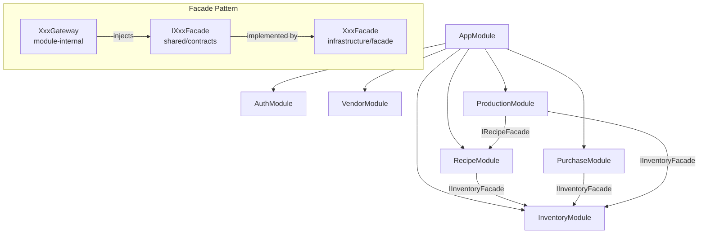
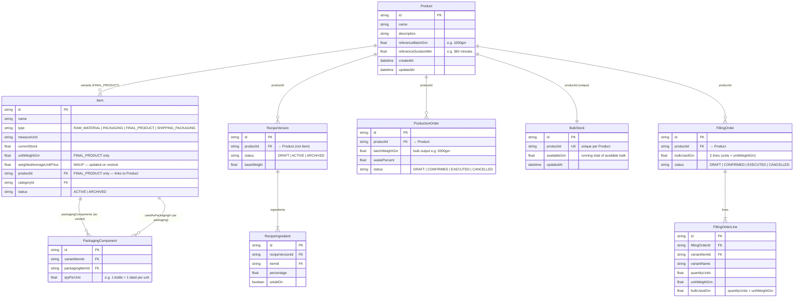
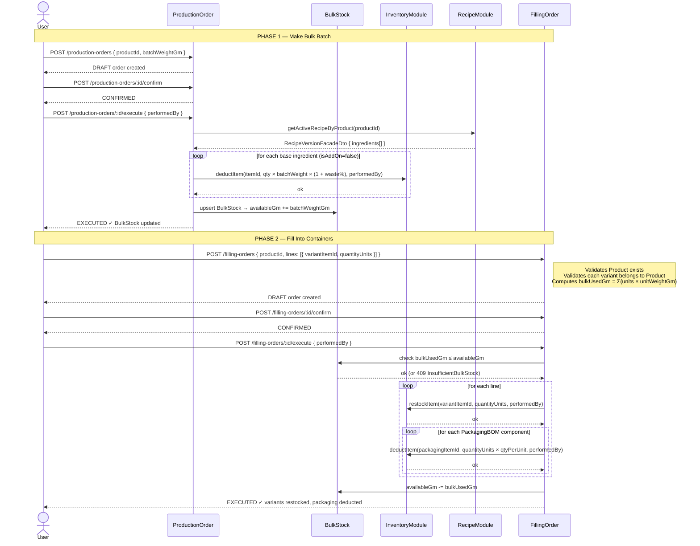

# Sakura Backend — Architecture Review

This document summarizes the architecture of the Sakura ERP backend. It covers the module structure, core data model, the two-phase production workflow, and all API endpoints.

---

## Module Dependency Graph

Modules communicate exclusively through the **Facade pattern** — no module imports another module's internals.



---

## Core Data Model



---

## Two-Phase Production Flow



---

## Item Types

| Type | Purpose | Has WAUP | Has `unitWeightGm` | Has PackagingBOM |
|---|---|:---:|:---:|:---:|
| `RAW_MATERIAL` | Ingredients (oils, wax, butter) | ✅ | — | — |
| `PACKAGING` | Bottles, jars, labels, caps | ✅ | — | — |
| `FINAL_PRODUCT` | Sized sellable product variants | ✅ | ✅ | ✅ |
| `SHIPPING_PACKAGING` | Boxes, bags, mailers *(Sales — future)* | ✅ | — | — |

**WAUP formula** (computed on each restock, stored on Item):
```
newWAUP = (currentStock × oldWAUP + newQty × newUnitPrice) / (currentStock + newQty)
```

**Production Rate** (for cost calculation, stored on Product):
```
estimatedDurationMin = (batchWeightGm / referenceBatchGm) × referenceDurationMin
```

---

## API Endpoints

### Inventory Module — `/api/v1/inventory`

#### Products
| Method | Path | Description |
|---|---|---|
| `POST` | `/products` | Create a new Product (pass `referenceBatchGm`, `referenceDurationMin`) |
| `GET` | `/products` | List all Products |
| `GET` | `/products/:id` | Get Product by ID |
| `PATCH` | `/products/:id` | Update Product |

#### Items
| Method | Path | Description |
|---|---|---|
| `POST` | `/items` | Create Item (pass `productId` for FINAL_PRODUCT) |
| `GET` | `/items` | List all Items |
| `GET` | `/items/:id` | Get Item by ID |
| `PATCH` | `/items/:id` | Update Item |
| `POST` | `/items/:id/restock` | Restock (updates WAUP + creates transaction) |
| `POST` | `/items/:id/deduct` | Deduct (creates transaction) |
| `PUT` | `/items/:id/packaging-bom` | Replace PackagingBOM for a FINAL_PRODUCT variant |
| `POST` | `/items/:id/archive` | Soft-delete (archive) |

#### Categories
| Method | Path | Description |
|---|---|---|
| `POST` | `/categories` | Create Category |
| `GET` | `/categories` | List Categories |
| `GET` | `/categories/:id` | Get Category by ID |
| `PATCH` | `/categories/:id` | Update Category |

---

### Recipe Module — `/api/v1/recipes`

| Method | Path | Description |
|---|---|---|
| `POST` | `/` | Create RecipeVersion (requires `productId` → Product) |
| `GET` | `/` | List all RecipeVersions |
| `GET` | `/:id` | Get RecipeVersion by ID |
| `POST` | `/:id/ingredients` | Add ingredient to recipe |
| `PATCH` | `/:id/ingredients/:ingredientId` | Update ingredient percentage |
| `DELETE` | `/:id/ingredients/:ingredientId` | Remove ingredient |
| `POST` | `/:id/activate` | Activate recipe (validates 100% base formula) |
| `POST` | `/:id/archive` | Archive recipe |
| `GET` | `/product/:productId/active` | Get active recipe for a product |
| `GET` | `/product/:productId/versions` | Get all versions for a product |

---

### Purchase Module — `/api/v1/purchases`

| Method | Path | Description |
|---|---|---|
| `POST` | `/` | Create Purchase Order (DRAFT) |
| `GET` | `/` | List Purchase Orders |
| `GET` | `/:id` | Get Purchase Order by ID |
| `PATCH` | `/:id` | Update PO (while DRAFT) |
| `POST` | `/:id/confirm` | DRAFT → CONFIRMED |
| `POST` | `/:id/receive` | CONFIRMED → RECEIVED (auto-restocks items) |
| `POST` | `/:id/cancel` | → CANCELLED |

---

### Production Module

#### Production Orders (Phase 1) — `/api/v1/production-orders`

| Method | Path | Description |
|---|---|---|
| `POST` | `/` | Create ProductionOrder DRAFT |
| `GET` | `/` | List ProductionOrders |
| `GET` | `/:id` | Get by ID |
| `PATCH` | `/:id` | Update (while DRAFT) |
| `POST` | `/:id/confirm` | DRAFT → CONFIRMED |
| `POST` | `/:id/execute` | CONFIRMED → EXECUTED (deducts ingredients, adds to BulkStock) |
| `POST` | `/:id/cancel` | → CANCELLED |

#### Filling Orders (Phase 2) — `/api/v1/filling-orders`

| Method | Path | Description |
|---|---|---|
| `POST` | `/` | Create FillingOrder DRAFT |
| `GET` | `/` | List FillingOrders |
| `GET` | `/:id` | Get by ID |
| `POST` | `/:id/confirm` | DRAFT → CONFIRMED |
| `POST` | `/:id/execute` | CONFIRMED → EXECUTED (deducts bulk, restocks variants, deducts packaging) |
| `POST` | `/:id/cancel` | → CANCELLED |

---

## Database Layout

Each module owns its own PostgreSQL database and Prisma client — zero shared tables.

| Module | Database | Env Var |
|---|---|---|
| Auth | `sakura_users_db` | `AUTH_DATABASE_URL` |
| Vendor | `sakura_vendor_db` | `VENDOR_DATABASE_URL` |
| Inventory | `sakura_inventory_db` | `INVENTORY_DATABASE_URL` |
| Recipe | `sakura_recipe_db` | `RECIPE_DATABASE_URL` |
| Purchase | `sakura_purchase_db` | `PURCHASE_DATABASE_URL` |
| Production | `sakura_production_db` | `PRODUCTION_DATABASE_URL` |

---

## What's Next — Sales Module

The Sales module was deferred while this refactor completed. It will:

- Link sale lines to `FINAL_PRODUCT` Items and use WAUP for cost-of-goods calculation
- Deduct `SHIPPING_PACKAGING` items per order (already supported by inventory)
- Introduce `SalesOrder` lifecycle: DRAFT → CONFIRMED → SHIPPED → CANCELLED
- Use `referenceBatchGm` + `referenceDurationMin` from Product for labour cost per unit
- Expose margin/profitability reporting
