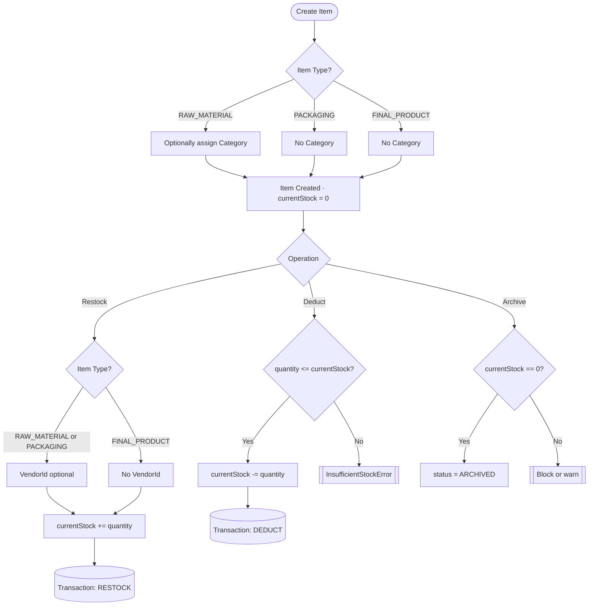
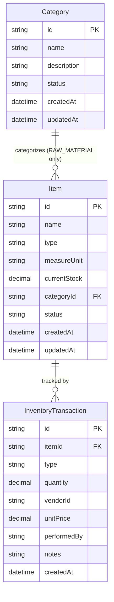

# Inventory Module — Full Discussion Document
**Sakura ERP | Cosmetics Factory**
_Last updated: 2026-03-18_

---

## 1. Overview

The Inventory module manages the stock of all physical items in the cosmetics factory warehouse. It covers three item types, tracks every stock movement, and provides filtering/search capabilities. It is designed to integrate with a future **Purchase Order module** (which will own vendor pricing) and the **Auth module** (which owns user identity).

---

## 2. Item Types

| Type | Description | Has Category? | Vendor on Restock? |
|------|-------------|:-:|:-:|
| `RAW_MATERIAL` | Cosmetic ingredients (glycerin, pigments, etc.) | ✅ | ✅ |
| `PACKAGING` | Bottles, tubes, boxes, labels | ❌ | ✅ |
| `FINAL_PRODUCT` | Finished manufactured products | ❌ | ❌ |

> Final products are produced internally, not purchased — so no vendor on restock.

---

## 3. Core Entities

### 3.1 Item (Item Master)
The catalog entry for a storable item. Defines *what* exists, not *how much* or *what it cost*.

| Field | Type | Notes |
|-------|------|-------|
| `id` | CUID | Primary key |
| `name` | String (unique) | e.g. "Glycerin 99%", "50ml Bottle" |
| `type` | Enum | RAW_MATERIAL, PACKAGING, FINAL_PRODUCT |
| `measureUnit` | Enum | KG, G, L, ML, PCS |
| `currentStock` | Decimal | Maintained via transactions, default 0 |
| `categoryId` | FK (nullable) | Only set for RAW_MATERIAL |
| `status` | Enum | ACTIVE, ARCHIVED |
| `createdAt` | DateTime | |
| `updatedAt` | DateTime | |

### 3.2 Category (Raw Material Category)
Groups raw materials into meaningful types for filtering and reporting.

| Field | Type | Notes |
|-------|------|-------|
| `id` | CUID | |
| `name` | String (unique) | e.g. "Emulsifiers", "Pigments", "Preservatives" |
| `description` | String? | Optional |
| `status` | Enum | ACTIVE, ARCHIVED |
| `createdAt` | DateTime | |
| `updatedAt` | DateTime | |

> Categories are user-managed (created/edited by users), not seeded.

### 3.3 InventoryTransaction (Stock Movement Audit Trail)
Every stock change is an immutable transaction record. This is the source of truth for stock history.

| Field | Type | Notes |
|-------|------|-------|
| `id` | CUID | |
| `itemId` | FK → Item | |
| `type` | Enum | RESTOCK, DEDUCT |
| `quantity` | Decimal | Always positive |
| `vendorId` | String? | Denormalized ref to Vendor module. Nullable. Only on RESTOCK for RAW_MATERIAL / PACKAGING |
| `unitPrice` | Decimal? | Reserved for future PO module. Nullable for now |
| `performedBy` | String | userId from Auth module (denormalized) |
| `notes` | String? | Optional reason/context |
| `createdAt` | DateTime | Immutable — transactions are never updated or deleted |

---

## 4. Domain Rules

### Item Rules
- Item name must be **unique** across all types
- `categoryId` can only be set when `type = RAW_MATERIAL`
- Cannot set `categoryId` on PACKAGING or FINAL_PRODUCT
- `currentStock` is always `>= 0` (system enforced)
- Archived items cannot be restocked or deducted
- Measure unit cannot be changed once transactions exist

### Stock Rules
- **Restock**: quantity must be `> 0`
- **Deduct**: quantity must be `> 0` AND `<= currentStock` (no negative stock allowed)
- FINAL_PRODUCT restock does not require a vendorId
- Transactions are **immutable** — never edited or deleted (audit integrity)

### Category Rules
- Category name must be unique
- Cannot archive a category that has ACTIVE items linked to it
- Archiving a category does not affect its items — they keep the categoryId

### 4.1 Stock Operation Flow



---

## 5. Commands (Write Operations)

### Item Commands
| Command | Description |
|---------|-------------|
| `CreateItem` | Define a new item in the catalog with 0 stock |
| `UpdateItem` | Edit item name, measure unit, category (if raw material) |
| `ArchiveItem` | Soft-delete an item (must have 0 stock or explicit override) |
| `RestockItem` | Add quantity + record transaction (vendorId optional per type) |
| `DeductItem` | Remove quantity + record transaction (blocked if insufficient stock) |

### Category Commands
| Command | Description |
|---------|-------------|
| `CreateCategory` | Create a new raw material category |
| `UpdateCategory` | Edit category name/description |
| `ArchiveCategory` | Soft-delete (blocked if active items linked) |

---

## 6. Queries (Read Operations)

### Item Queries
| Query | Filters / Params |
|-------|-----------------|
| `GetItemById` | itemId |
| `GetAllItems` | type, categoryId, vendorId (from transactions), stockStatus (IN_STOCK / OUT_OF_STOCK), search (name), status |
| `GetItemTransactions` | itemId, transactionType (RESTOCK/DEDUCT), dateFrom, dateTo, performedBy |

### Category Queries
| Query | Filters |
|-------|---------|
| `GetAllCategories` | status (ACTIVE/ARCHIVED), search (name) |
| `GetCategoryById` | categoryId |

---

## 7. API Endpoints

Base: `/api/v1/inventory`

### Items
```
POST   /items                      → Create item
GET    /items                      → List items (query filters)
GET    /items/:id                  → Get item by ID
PATCH  /items/:id                  → Update item
POST   /items/:id/archive          → Archive item
POST   /items/:id/restock          → Restock item
POST   /items/:id/deduct           → Deduct from item
GET    /items/:id/transactions     → Item stock history
```

### Categories
```
POST   /categories                 → Create category
GET    /categories                 → List categories
GET    /categories/:id             → Get category by ID
PATCH  /categories/:id             → Update category
POST   /categories/:id/archive     → Archive category
```

---

## 8. Prisma Schema (Proposed)

```prisma
generator client {
  provider = "prisma-client-js"
  output   = "./generated/client"
}

datasource db {
  provider = "postgresql"
}

model Item {
  id           String   @id @default(cuid())
  name         String   @unique
  type         String   // RAW_MATERIAL | PACKAGING | FINAL_PRODUCT
  measureUnit  String   // KG | G | L | ML | PCS
  currentStock Decimal  @default(0)
  categoryId   String?
  status       String   @default("ACTIVE")
  createdAt    DateTime @default(now())
  updatedAt    DateTime @updatedAt

  category     Category?              @relation(fields: [categoryId], references: [id])
  transactions InventoryTransaction[]

  @@map("items")
}

model Category {
  id          String   @id @default(cuid())
  name        String   @unique
  description String?
  status      String   @default("ACTIVE")
  createdAt   DateTime @default(now())
  updatedAt   DateTime @updatedAt

  items Item[]

  @@map("categories")
}

model InventoryTransaction {
  id          String   @id @default(cuid())
  itemId      String
  type        String   // RESTOCK | DEDUCT
  quantity    Decimal
  vendorId    String?
  unitPrice   Decimal?
  performedBy String
  notes       String?
  createdAt   DateTime @default(now())

  item Item @relation(fields: [itemId], references: [id])

  @@map("inventory_transactions")
}
```

### 8.1 Entity Relationship Diagram



---

## 9. Value Objects (Domain Layer)

| Value Object | Validates |
|-------------|-----------|
| `ItemId` | Valid CUID |
| `ItemName` | Non-empty, max length |
| `ItemType` | One of: RAW_MATERIAL, PACKAGING, FINAL_PRODUCT |
| `MeasureUnit` | One of: KG, G, L, ML, PCS |
| `ItemStatus` | ACTIVE or ARCHIVED |
| `CategoryId` | Valid CUID |
| `CategoryName` | Non-empty, max length |
| `TransactionId` | Valid CUID |
| `TransactionType` | RESTOCK or DEDUCT |
| `Quantity` | Decimal > 0 |

---

## 10. Domain Errors

| Error | Trigger |
|-------|---------|
| `ItemNotFoundError` | itemId doesn't exist |
| `ItemAlreadyExistsError` | Duplicate item name |
| `ItemAlreadyArchivedError` | Operation on archived item |
| `InsufficientStockError` | Deduct quantity > currentStock |
| `CategoryNotFoundError` | categoryId doesn't exist |
| `CategoryAlreadyExistsError` | Duplicate category name |
| `CategoryHasActiveItemsError` | Archive blocked — items still linked |
| `InvalidCategoryForItemTypeError` | Setting category on non-RAW_MATERIAL |
| `InvalidQuantityError` | Quantity <= 0 |

---

## 11. Future Integrations

| Module | Integration Point |
|--------|------------------|
| **Purchase Order** (future) | PO will generate RESTOCK transactions with vendorId + unitPrice populated |
| **Production** (future) | Production runs will generate DEDUCT transactions for raw materials and RESTOCK for final products |
| **Auth** | `performedBy` on transactions = userId from Auth module |
| **Vendor** | `vendorId` on transactions = vendorId from Vendor module |

---

## 12. Resolved Decisions

| Question | Decision |
|----------|----------|
| `measureUnit` type | Fixed enum: KG, G, L, ML, PCS |
| Item types | 3 types final — RAW_MATERIAL, PACKAGING, FINAL_PRODUCT |
| Batch tracking on FINAL_PRODUCT restock | Skipped — belongs to future Production module |
| Roles & permissions per operation | Deferred — wire up role guards when roles are fully defined |
| Stock history pagination | Yes — 20 items per page default |
