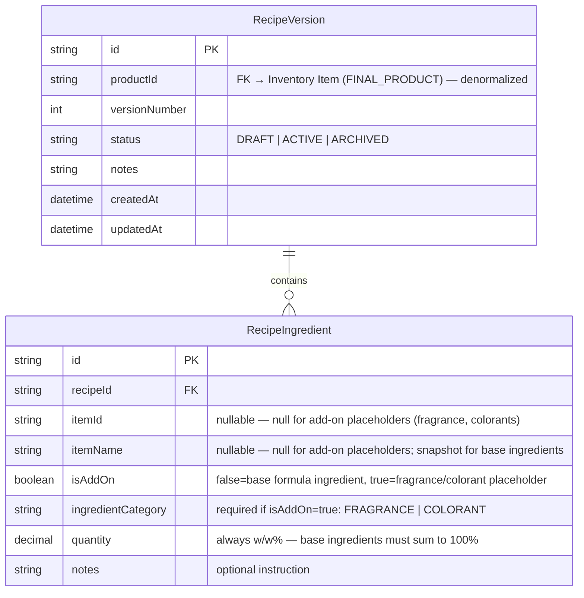
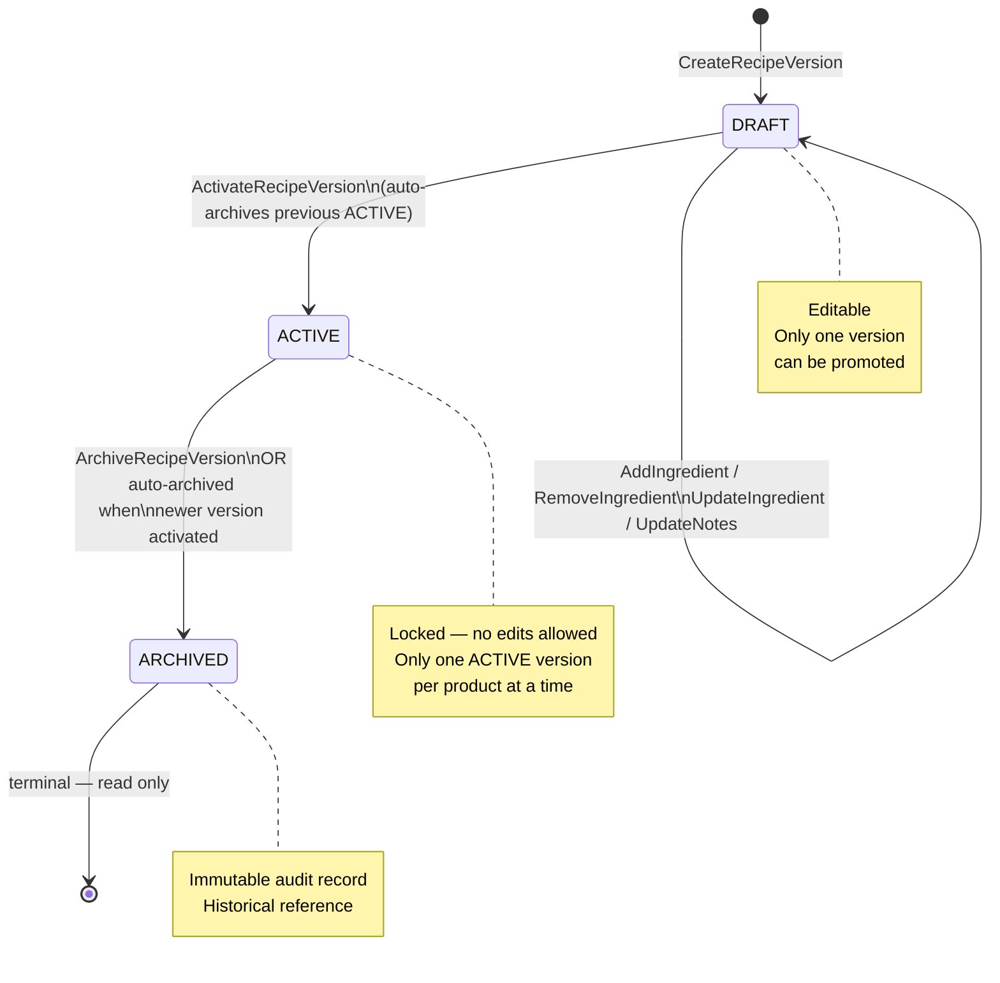
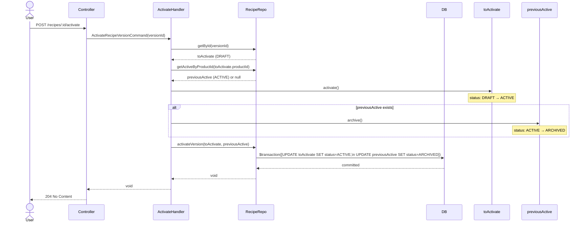
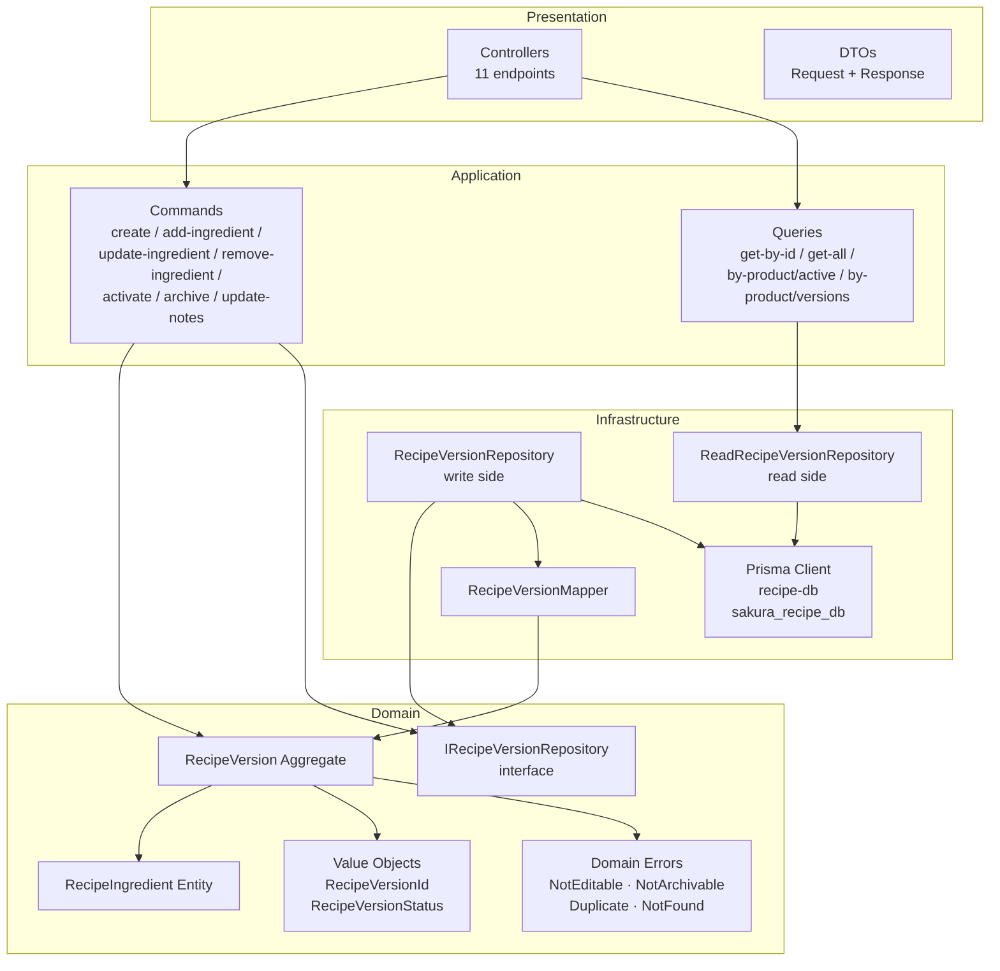
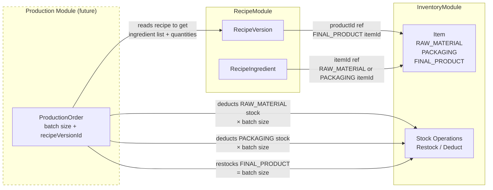

# Recipe Module — Design Discussion

Sakura ERP · Cosmetics Factory · Recipe/Formula Management

---

## 1. Purpose

A **Recipe** defines the formula to manufacture one unit of a FINAL_PRODUCT.
It lists the RAW_MATERIAL and PACKAGING inventory items required, with quantities
per unit of output. Batch size is applied at production time (future module).

Recipes support **full version history**: formulas can change over time but old
versions are never deleted — they are archived for audit purposes.

---

## 2. Entity Relationship Diagram



> **Cross-module references**: `productId` and `itemId` are denormalized string IDs —
> no database foreign key to the Inventory module. Validation is the application's
> responsibility (future: verify item type at add-ingredient time).

---

## 3. Version Status Lifecycle



---

## 4. Activate Recipe — Sequence Flow



---

## 5. Module Internal Architecture



---

## 6. Cross-Module Communication



> **Current scope**: Recipe module stores `productId` and `itemId` as denormalized strings with no DB foreign key to Inventory. Base ingredients snapshot `itemName` + `itemType` at write time (zero runtime calls at read time). Add-on placeholders (fragrance, colorants) have no `itemId` — the specific item is resolved at production time by the Production module.

---

## 7. API Endpoints Summary

| Method | Path | Description |
|---|---|---|
| POST | `/api/v1/recipes` | Create new DRAFT recipe version |
| GET | `/api/v1/recipes` | List versions (filter: productId, status) |
| PATCH | `/api/v1/recipes/:id` | Update notes (DRAFT only) |
| POST | `/api/v1/recipes/:id/activate` | Promote to ACTIVE |
| POST | `/api/v1/recipes/:id/archive` | Archive (ACTIVE only) |
| GET | `/api/v1/recipes/:id` | Get version by ID |
| POST | `/api/v1/recipes/:id/ingredients` | Add ingredient (DRAFT only) |
| PATCH | `/api/v1/recipes/:id/ingredients/:iid` | Update ingredient (DRAFT only) |
| DELETE | `/api/v1/recipes/:id/ingredients/:iid` | Remove ingredient (DRAFT only) |
| GET | `/api/v1/recipes/product/:productId/active` | Get current active recipe |
| GET | `/api/v1/recipes/product/:productId/versions` | Get all versions for product |

---

## 8. Domain Rules Summary

| Rule | Enforcement |
|---|---|
| Only DRAFT versions can be edited | `RecipeVersionNotEditableError` thrown in aggregate |
| Same base item cannot appear twice | `DuplicateIngredientError` + DB `@@unique([recipeId, itemId])` (nulls excluded by postgres) |
| Same add-on category cannot appear twice | `DuplicateIngredientError` + DB `@@unique([recipeId, ingredientCategory])` (nulls excluded) |
| Only one ACTIVE version per product | Activate command archives previous; DB has no unique constraint (ARCHIVED can coexist) |
| Only ACTIVE versions can be archived manually | `RecipeVersionNotArchivableError` thrown in aggregate |
| Base ingredients must sum to 100% at activation | `RecipeVersionInvalidFormulaError` in `activate()` if `isAddOn=false` sum ≠ 100% (±0.01) |
| All quantities are percentages (w/w%) | `@IsPositive()` + `@Max(100)` on DTO; `measureUnit` field removed |
| Recipe contains formula only — no packaging | Packaging is a Production module concern |
| Add-on placeholder has no itemId | `itemId` / `itemName` null when `isAddOn=true`; `ingredientCategory` required |
| Base ingredient must have itemId + itemName | Required when `isAddOn=false`; validated via `@ValidateIf` on DTO |

---

## 9. Quantity Model — Design Decision

### Decision: Recipe = Formula Only (No Packaging)

Packaging is **not part of the recipe**. It is a production/logistics concern decided when a production order is created (future module). The same formula can be filled into different container sizes or types without changing the recipe.

### Ingredient Semantics

| isAddOn | Quantity meaning | itemId | ingredientCategory |
|---|---|---|---|
| `false` | w/w% of batch weight — base formula, must collectively sum to 100% | required (snapshot) | null |
| `true` | w/w% of batch weight — add-on placeholder, not counted in 100% | **null** | required (`FRAGRANCE` / `COLORANT`) |

All quantities are percentages. `measureUnit` field is removed — it is always `%`, implied by the model.

### Base Formula (isAddOn=false)
Core cosmetic ingredients — must sum to **100%** before activation.

```
{ itemName: 'Aqua',       isAddOn: false, quantity: 65.0 }
{ itemName: 'Shea Butter',isAddOn: false, quantity: 20.0 }
{ itemName: 'Emulsifier', isAddOn: false, quantity: 15.0 }
// sum = 100% → activation allowed ✅
```

### Add-on Placeholders (isAddOn=true)
Fragrance and colorants — the **specific item is decided at production time**. The recipe only reserves a % slot.

```
{ ingredientCategory: 'FRAGRANCE', isAddOn: true, quantity: 1.0 }  // which fragrance — TBD at production
{ ingredientCategory: 'COLORANT',  isAddOn: true, quantity: 0.5 }  // which mica/pigment — TBD at production
```

### At Production Time (future module)
| Ingredient | Calculation |
|---|---|
| Base (`isAddOn=false`) | `actual_weight = batch_weight_kg × (quantity / 100)` |
| Add-on (`isAddOn=true`) | `actual_weight = batch_weight_kg × (quantity / 100)` |
| Packaging | Decided by the production order — not in recipe |

---

## 10. Ingredient Enrichment Strategy — Design Decision

**Question**: When viewing a recipe, how do we show item names and types alongside `itemId`?

### Options Considered

| Option | Approach | Verdict |
|---|---|---|
| A | Return `itemId` only; frontend resolves via separate inventory calls | ❌ N+1 problem, chatty API |
| B | Runtime call from Recipe read handler → Inventory module | ❌ Couples modules, latency, availability risk |
| C | Snapshot `itemName` + `itemType` at write time (add-ingredient) | ✅ **Chosen** |
| D | Event-driven projection (listen to `ItemUpdated` events) | ❌ Overkill for this monolith |

### Decision: Option C — Snapshot Denormalization

When `AddIngredient` is called, `itemName` and `itemType` are stored alongside `itemId` in `RecipeIngredient`. Recipe reads are fully self-contained — zero cross-module calls.

**Why this is correct for a manufacturing BOM:**
A recipe version is a point-in-time specification. If "Rose Extract 100ml" is later renamed, historical recipe versions correctly retain the name they were authored with — this is an audit requirement, not a limitation.

### Schema Impact

```prisma
model RecipeIngredient {
  id          String        @id
  recipeId    String
  itemId      String
  itemName    String        // snapshotted at add-ingredient time
  itemType    String        // RAW_MATERIAL | PACKAGING — snapshotted
  quantity    Decimal
  measureUnit String
  notes       String?
  recipe      RecipeVersion @relation(fields: [recipeId], references: [id], onDelete: Cascade)

  @@unique([recipeId, itemId])
}
```

### Application Impact

`AddIngredientRequestDto` requires two additional fields:
```ts
@IsString() @IsNotEmpty() itemName: string;
@IsIn(['RAW_MATERIAL', 'PACKAGING']) itemType: string;
```

`RecipeIngredient` entity gains `itemName: string` and `itemType: string` fields.

---

## 11. Decisions

| Question | Answer |
|---|---|
| Scope | Formula/BOM only — no production execution |
| Versioning | DRAFT → ACTIVE → ARCHIVED, full history kept |
| Yield | Scalable — quantities per 1 unit, batch size at production time |
| Product link | Tied to FINAL_PRODUCT item ID from inventory (denormalized string) |
| Ingredient notes | Optional instruction note per ingredient line |
| Database | `sakura_recipe_db` / `RECIPE_DATABASE_URL` |
| Ingredient enrichment | Snapshot `itemName` + `itemType` at write time (Option C) |
