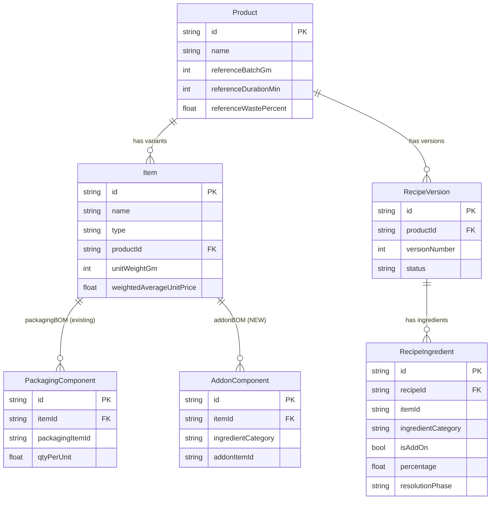
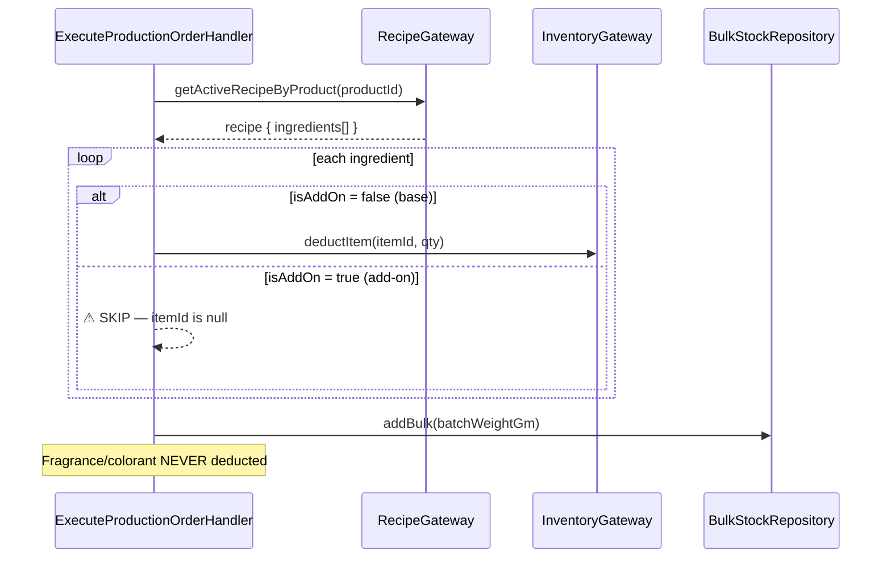
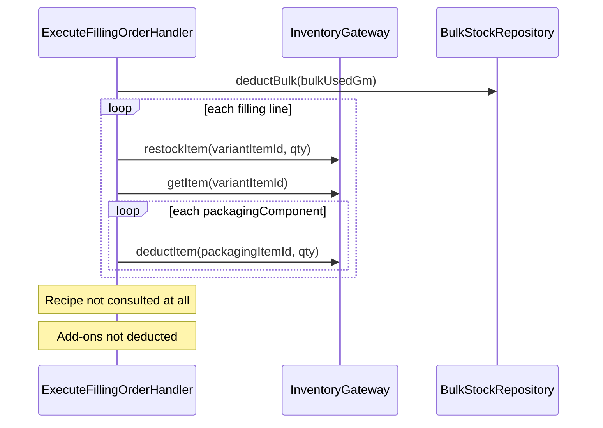
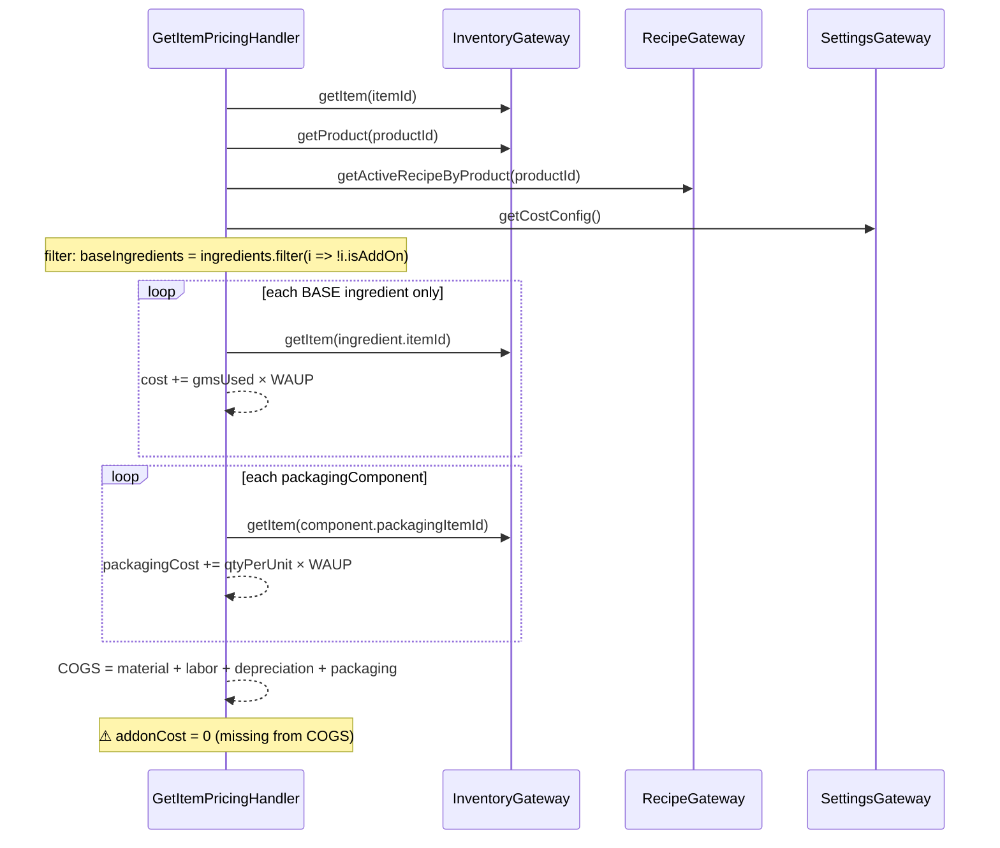
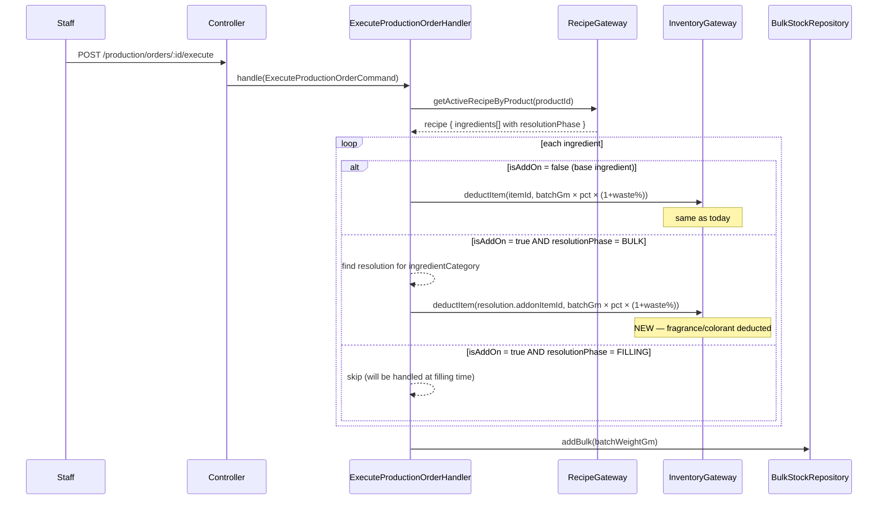
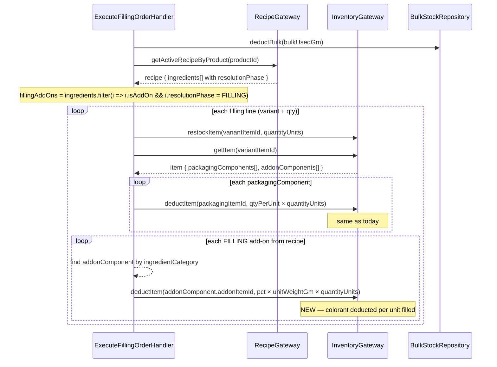
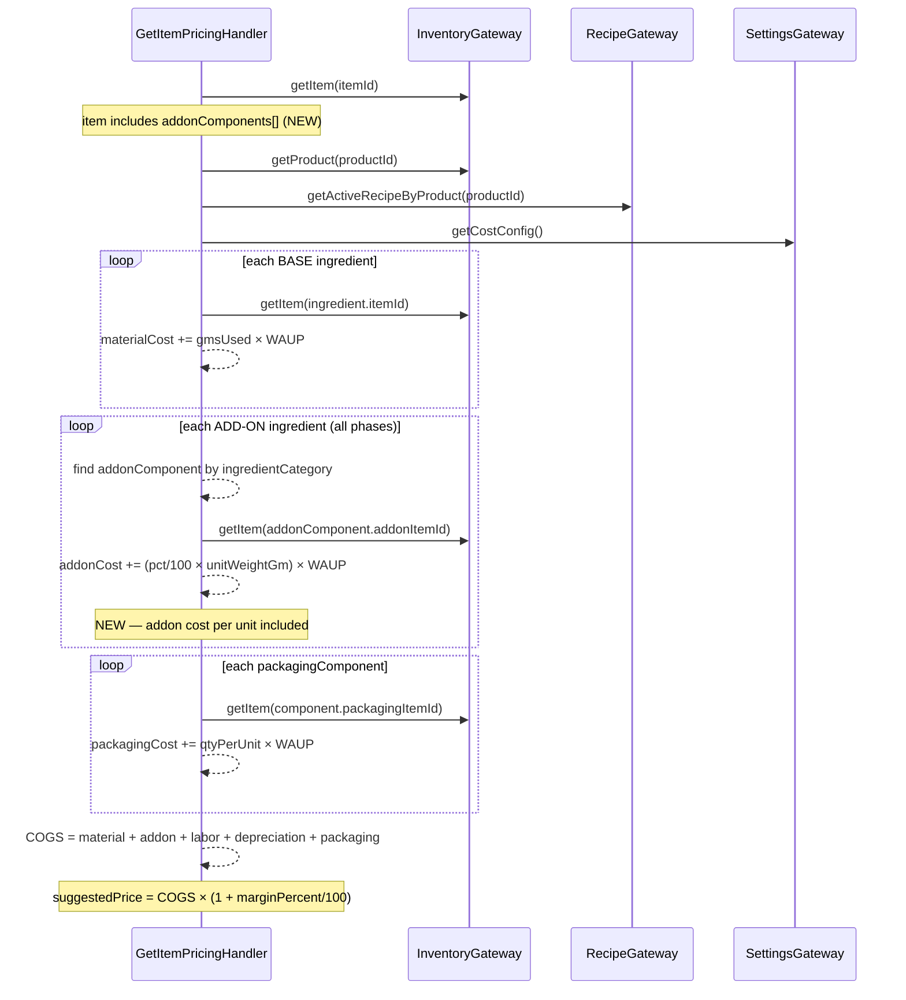
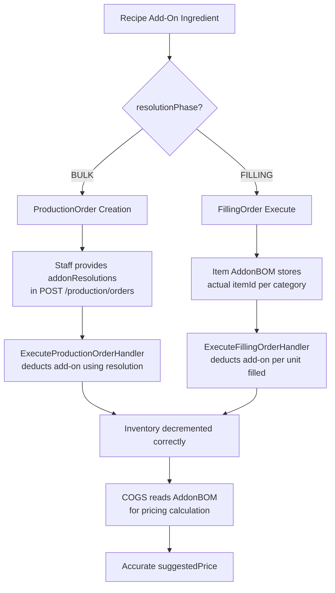

# Add-On BOM System — Design Document

> Feature branch: `feat/addon-bom`
> Status: Design review (not yet implemented)

---

## Table of Contents

1. [Problem Statement](#1-problem-statement)
2. [Business Model — Products & Variants](#2-business-model--products--variants)
3. [Current Flow (Broken)](#3-current-flow-broken)
4. [Proposed Data Model](#4-proposed-data-model)
5. [Quantity Derivation](#5-quantity-derivation)
6. [New Phase 1 Flow — ProductionOrder with BULK Add-Ons](#6-new-phase-1-flow--productionorder-with-bulk-add-ons)
7. [New Phase 2 Flow — FillingOrder with FILLING Add-Ons](#7-new-phase-2-flow--fillingorder-with-filling-add-ons)
8. [New COGS Flow — Pricing with Add-On Cost](#8-new-cogs-flow--pricing-with-add-on-cost)
9. [API Changes](#9-api-changes)
10. [Implementation Scope per Module](#10-implementation-scope-per-module)

---

## 1. Problem Statement

### What is broken today

Recipe add-on ingredients (fragrance, colorant) are defined as **category placeholders** with `itemId = null`. They describe the *type* of ingredient needed (e.g. "fragrance") but not the specific item.

Because `itemId` is null, the system cannot deduct these items from inventory or include their cost in pricing. The result:

| Symptom | Root cause |
|---------|-----------|
| Fragrance/colorant inventory never decrements | `ExecuteProductionOrderHandler` skips add-ons: `if (ingredient.isAddOn) continue` |
| Filling orders don't track fragrance/colorant | `ExecuteFillingOrderHandler` doesn't involve the recipe at all |
| COGS is understated | `GetItemPricingHandler` filters: `recipe.ingredients.filter(i => !i.isAddOn)` |
| Suggested sale price is too low | COGS missing addon cost → margin calculation is wrong |

---

## 2. Business Model — Products & Variants

A **Product** is a formula family. It has multiple **size variants** and each size comes in multiple **scents**. Each size × scent combination is a separate `FINAL_PRODUCT` item in inventory.

```
Product: "Rose Body Butter"
  ├── Variant: Body Butter 50gm Rose      ← uses Rose Fragrance + Pink Colorant
  ├── Variant: Body Butter 50gm Lavender  ← uses Lavender Fragrance + Purple Colorant
  ├── Variant: Body Butter 50gm Bergamot  ← uses Bergamot Fragrance + Yellow Colorant
  ├── Variant: Body Butter 150gm Rose     ← uses Rose Fragrance + Pink Colorant
  ├── Variant: Body Butter 150gm Lavender ← uses Lavender Fragrance + Purple Colorant
  └── Variant: Body Butter 150gm Bergamot ← uses Bergamot Fragrance + Yellow Colorant
```

**Key rule:** The fragrance and colorant for each variant are **fixed and known** — a Rose variant always uses Rose Fragrance Oil. This never varies batch-to-batch for the same variant.

### Entity Relationship (current + proposed)



---

## 3. Current Flow (Broken)

### Phase 1 — ProductionOrder Execute (today)



### Phase 2 — FillingOrder Execute (today)



### COGS Calculation (today)



---

## 4. Proposed Data Model

### 4.1 Recipe DB — add `resolutionPhase` to RecipeIngredient

New field: `resolutionPhase: 'BULK' | 'FILLING'` (default: `'FILLING'`)

- `BULK` — this add-on is mixed into the bulk during **Phase 1** (ProductionOrder). Example: fragrance in body splash — cannot produce neutral bulk.
- `FILLING` — this add-on is added when filling into containers during **Phase 2** (FillingOrder). Example: colorant added per jar.

```
recipe_ingredients table — after migration:
  id                  string PK
  recipeId            string FK
  itemId              string? (null for add-ons)
  ingredientCategory  string? (e.g. "fragrance", "colorant")
  isAddOn             bool
  percentage          decimal
  resolutionPhase     string  DEFAULT 'FILLING'   ← NEW
  notes               string?
```

### 4.2 Inventory DB — new `addon_components` table

Links each FINAL_PRODUCT variant to the actual items used for each add-on category.

```
addon_components table (NEW):
  id                  string PK
  itemId              string FK → items.id  (the variant: "Body Butter 50gm Rose")
  ingredientCategory  string               (matches recipe add-on: "fragrance")
  addonItemId         string               (the real item: "Rose Fragrance Oil")

  @@unique([itemId, ingredientCategory])   (one item per category per variant)
```

**No quantity stored** — quantity is always derived from the recipe at deduction time.

### 4.3 Production DB — new `production_order_addon_resolutions` table

Stores which items staff selected for BULK-phase add-ons when creating a ProductionOrder.

```
production_order_addon_resolutions table (NEW):
  id                  string PK
  orderId             string FK → production_orders.id
  ingredientCategory  string  (e.g. "fragrance")
  addonItemId         string  (e.g. "rose-fragrance-oil-id")
```

Only populated for BULK add-ons. FILLING add-ons are resolved at fill time from Item AddonBOM.

---

## 5. Quantity Derivation

No quantity is stored in AddonBOM or addon resolutions. It is always computed at the moment of deduction using the recipe percentage.

```
BULK add-on (deducted at ProductionOrder execute):
  qty = (recipe.percentage / 100) × batchWeightGm × (1 + wastePercent / 100)

FILLING add-on (deducted at FillingOrder execute, per line):
  qty = (recipe.percentage / 100) × line.unitWeightGm × line.quantityUnits

COGS add-on cost per unit (same formula for both):
  costPerUnit = (recipe.percentage / 100) × item.unitWeightGm × addonItem.WAUP
```

### Why no stored quantity?

- Recipe owns the percentage (single source of truth)
- If recipe is updated (new version activated), deduction automatically uses new percentage
- No sync problem between stored quantity and recipe percentage

---

## 6. New Phase 1 Flow — ProductionOrder with BULK Add-Ons

### How staff create a ProductionOrder with BULK add-ons

```json
POST /api/v1/production/orders
{
  "productId": "prod-abc",
  "batchWeightGm": 10000,
  "wastePercent": 5,
  "notes": "Batch #42",
  "addonResolutions": [
    { "ingredientCategory": "fragrance", "itemId": "rose-oil-id" }
  ]
}
```

`addonResolutions` is optional. If the recipe has BULK add-ons and none are provided, the order is created but execution will fail validation.

### Execute flow



---

## 7. New Phase 2 Flow — FillingOrder with FILLING Add-Ons

No changes to FillingOrder creation. The add-on resolution happens automatically at execute time using the variant item's AddonBOM.



---

## 8. New COGS Flow — Pricing with Add-On Cost



### New pricing response fields

```typescript
// Before
GetItemPricingResponse {
  materialPerUnit: number
  laborPerUnit: number
  depreciationPerUnit: number
  packagingPerUnit: number
  totalCogs: number
  suggestedPrice: number
}

// After
GetItemPricingResponse {
  materialPerUnit: number
  addonPerUnit: number        // NEW — fragrance + colorant cost per unit
  laborPerUnit: number
  depreciationPerUnit: number
  packagingPerUnit: number
  totalCogs: number           // now includes addonPerUnit
  suggestedPrice: number
}
```

---

## 9. API Changes

| Method | Endpoint | Change |
|--------|----------|--------|
| `POST` | `/recipes/:id/ingredients` | Accept `resolutionPhase: "BULK" \| "FILLING"` on add-on ingredients (default: `"FILLING"`) |
| `PUT` | `/inventory/items/:id/addon-bom` | **NEW** — replace all addon components for a variant item |
| `POST` | `/production/orders` | Accept optional `addonResolutions: [{ingredientCategory, itemId}]` |
| `GET` | `/sales/items/:id/pricing` | Response adds `addonPerUnit` field; `totalCogs` now includes addon cost |

### PUT /inventory/items/:id/addon-bom — request body

```json
[
  { "ingredientCategory": "fragrance", "addonItemId": "rose-oil-id" },
  { "ingredientCategory": "colorant",  "addonItemId": "pink-oxide-id" }
]
```

Replaces all existing addon components for the item (same pattern as PackagingBOM).

### POST /production/orders — with addon resolutions

```json
{
  "productId": "prod-abc",
  "batchWeightGm": 10000,
  "wastePercent": 5,
  "addonResolutions": [
    { "ingredientCategory": "fragrance", "itemId": "rose-oil-id" }
  ]
}
```

Only needed when the product's active recipe has BULK add-ons. Optional for products with all FILLING add-ons.

---

## 10. Implementation Scope per Module

### Decision flowchart — which phase handles each add-on



### Module breakdown

| Module | What changes | Files affected |
|--------|-------------|----------------|
| **Recipe** | Add `resolutionPhase` field to `RecipeIngredient` entity + DB migration + DTO + facade DTO | `recipe-ingredient.entity.ts`, `schema.prisma`, `add-ingredient.request.dto.ts`, `recipe-facade.interface.ts`, facade DTO |
| **Inventory** | New `addon_components` table + `AddonComponent` entity on `Item` + repo + `PUT addon-bom` endpoint + expose via facade | `schema.prisma`, `item.aggregate.ts`, `addon-component.entity.ts`, `addon-bom.repo.interface.ts`, new controller, `inventory-facade.interface.ts`, facade DTO |
| **Production** | `ProductionOrder` stores `addonResolutions[]` + execute handler deducts BULK add-ons + filling execute handler deducts FILLING add-ons | `production-order.aggregate.ts`, `schema.prisma`, `create-production-order.command.ts`, `execute-production-order.handler.ts`, `execute-filling-order.handler.ts`, `IRecipeFacade` usage in filling |
| **Sales** | COGS handler reads `addonComponents` from item + computes `addonPerUnit` + adds to response | `get-item-pricing.handler.ts`, `get-item-pricing.response.ts`, `item-pricing.response.dto.ts` |

### Migration summary

| DB | Migration |
|----|-----------|
| `sakura_recipe_db` | Add `resolution_phase VARCHAR DEFAULT 'FILLING'` to `recipe_ingredients` |
| `sakura_inventory_db` | Create `addon_components` table |
| `sakura_production_db` | Create `production_order_addon_resolutions` table |

---

*This document is for design review. No code has been changed yet.*
