# Sakura ERP — Frontend Guide

> This document is the complete handoff from the backend to the frontend. It covers every module, all API endpoints, state machines, data relationships, and frontend design recommendations for a new Claude session building the React frontend.

---

## 1. System Overview

**Sakura ERP** is an inventory & production management system for a cosmetics/soap manufacturing business. It manages the full lifecycle from raw material procurement → production → finished goods → sales.

### Core Flow

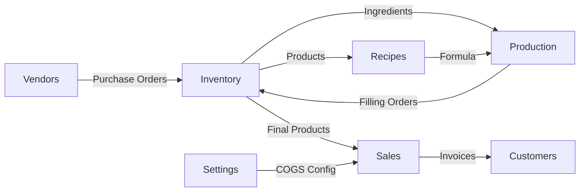

---

## 2. Module Map

| Module | Purpose | Key Entities |
|--------|---------|--------------|
| **Auth** | User login + RBAC | User (ADMIN / USER) |
| **Vendors** | Supplier management | Vendor (ACTIVE / INACTIVE) |
| **Inventory** | Stock tracking | Item (4 types), Category, Product, Transaction |
| **Recipes** | Formula/BOM | RecipeVersion (DRAFT → ACTIVE → ARCHIVED) |
| **Purchase** | Procurement | PurchaseOrder (DRAFT → CONFIRMED → RECEIVED) |
| **Production** | Bulk batch | ProductionOrder (DRAFT → CONFIRMED → EXECUTED) |
| **Production** | Fill into units | FillingOrder (DRAFT → CONFIRMED → EXECUTED) |
| **Sales** | Sell to customers | SalesOrder (DRAFT → CONFIRMED → SHIPPED), DiscountCode |
| **Settings** | COGS configuration | CostConfig (singleton) |

---

## 3. Data Architecture

### Entity Relationships

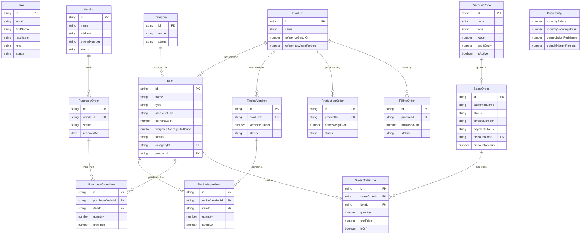

---

## 4. State Machines

### Vendor Status

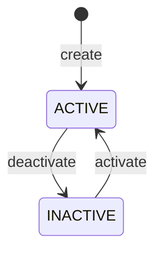

### Item / Category Status

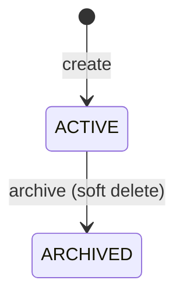

### Purchase Order Lifecycle

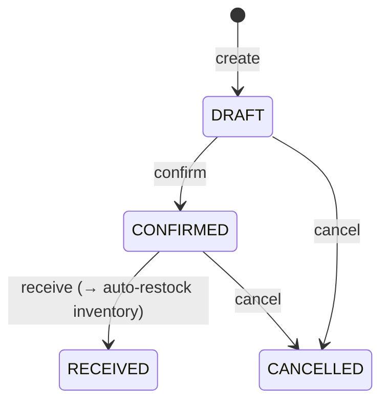

### Recipe Version Lifecycle

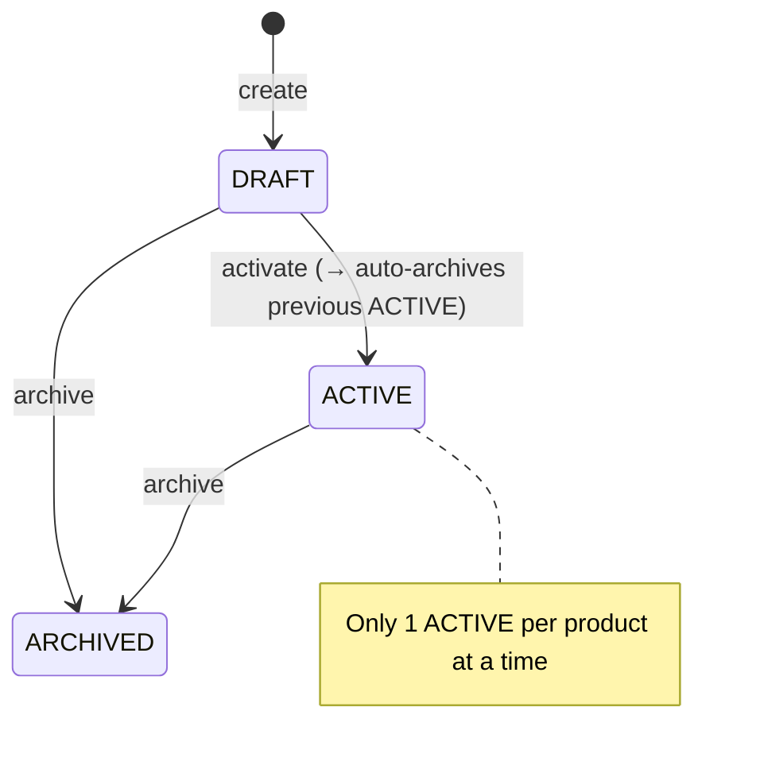

### Production Order Lifecycle

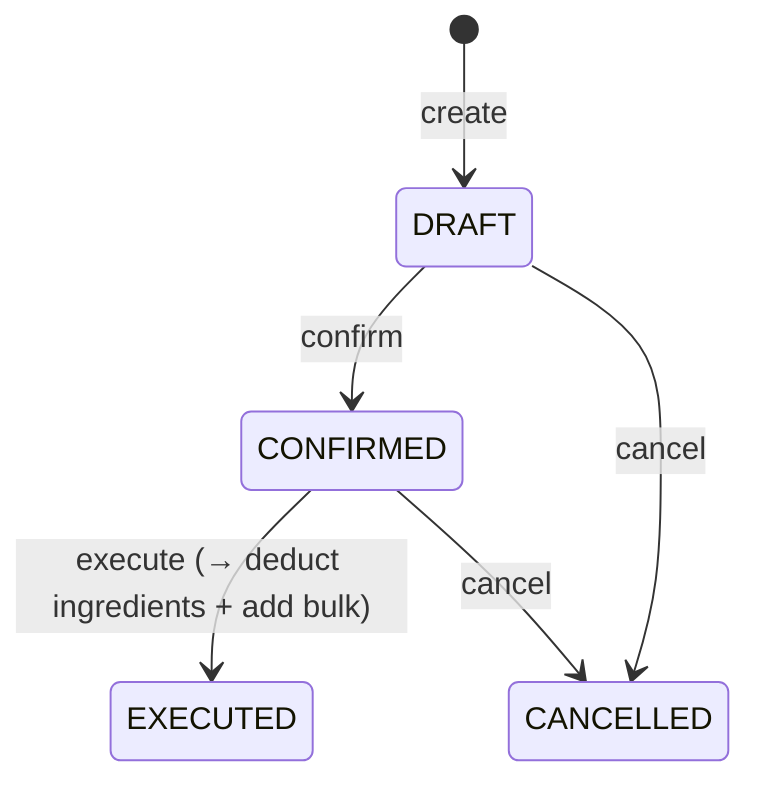

### Filling Order Lifecycle

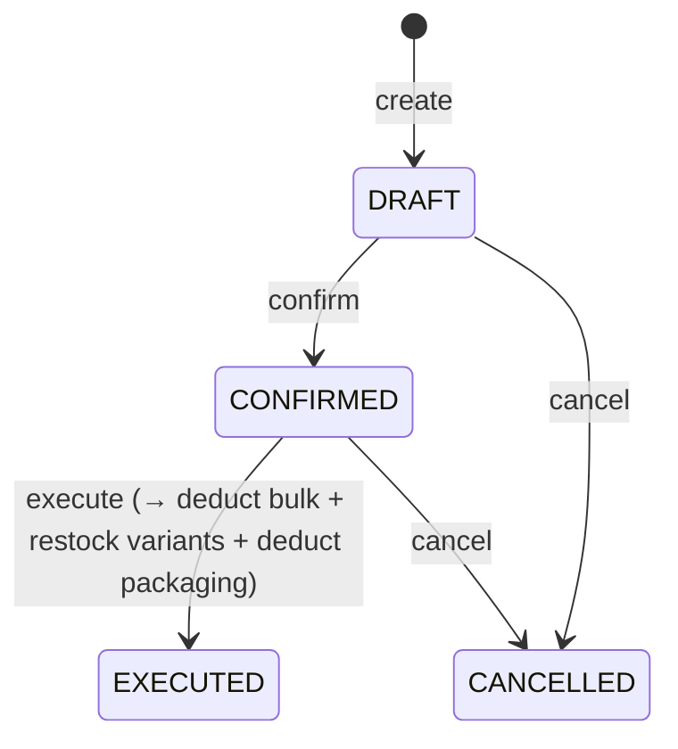

### Sales Order Lifecycle

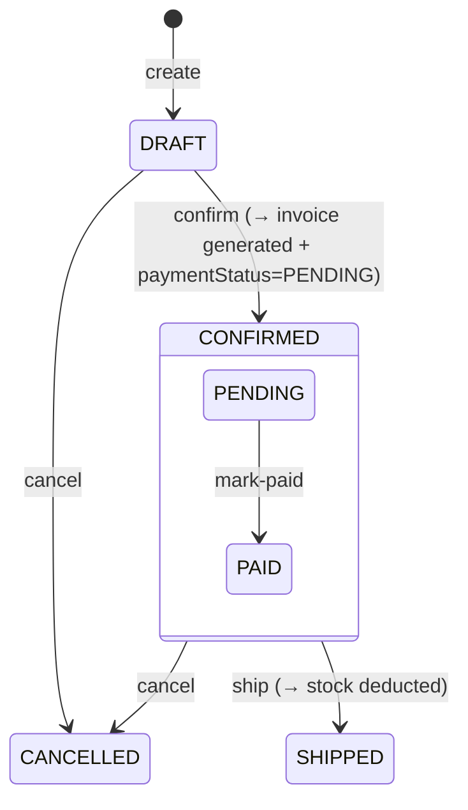

### Payment Status (on SalesOrder)

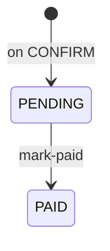

---

## 5. Production Flow (Two-Phase)

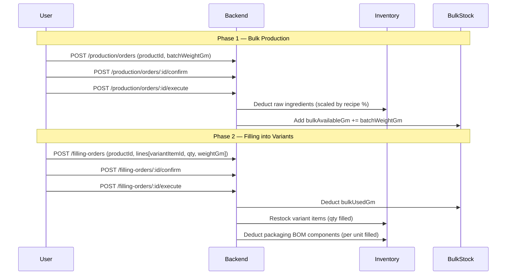

---

## 6. Purchase → Inventory Flow

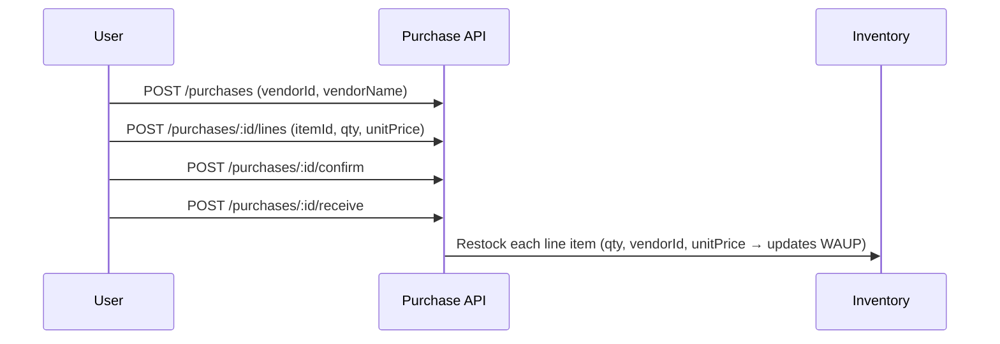

---

## 7. COGS / Pricing Calculation

```mermaid
flowchart TD
    CF[CostConfig<br>monthlySalary, workingHours, depreciationPerMinute, marginPercent]
    RV[Active RecipeVersion<br>ingredients with w/w%]
    WAUP[Item.weightedAverageUnitPrice]

    CF --> LC[Labor Cost/unit = salary / hours / batchDuration × batchUnits]
    CF --> DC[Depreciation Cost/unit = depreciationPerMinute × batchDuration / units]
    RV --> MC[Material Cost/unit = Σ ingredient% × WAUP × batchGm / units]
    WAUP --> MC
    LC --> COGS[Total COGS/unit]
    DC --> COGS
    MC --> COGS
    COGS --> SP[Suggested Price = COGS × (1 + marginPercent/100)]
```

---

## 8. Discount Code Behavior

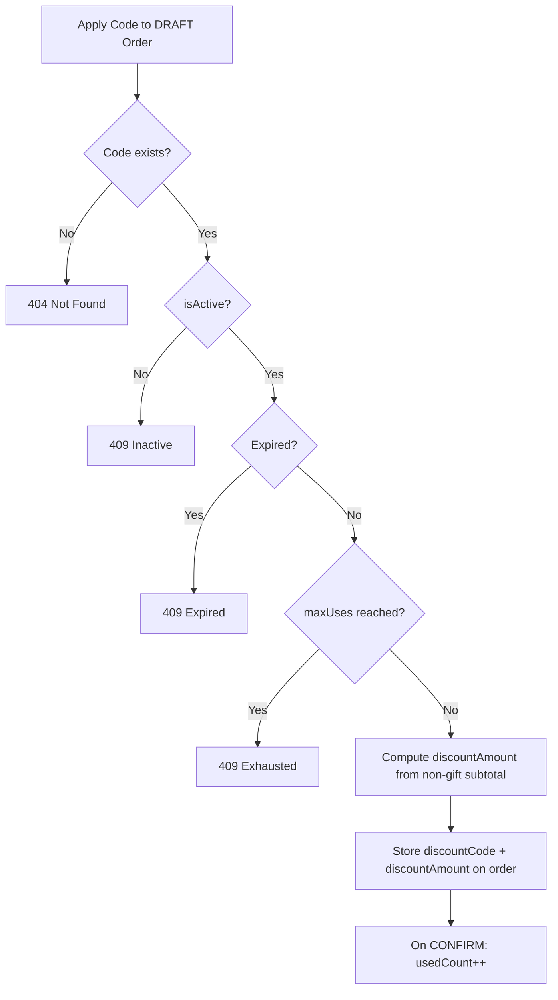

---

## 9. Complete API Reference

> Base URL: `http://localhost:3000/api/v1`

### Authentication

| Method | Path | Description | Body | Response |
|--------|------|-------------|------|----------|
| POST | `/auth/login` | Login | `{email, password}` | `{id, email, firstName, lastName, role, employeeId, phoneNumber}` + JWT cookie |
| POST | `/auth/logout` | Logout | — | void |
| GET | `/auth/user/me` | Current user | — | User object |
| GET | `/auth/user` | List users (ADMIN) | `?offset&limit&content&role` | User[] |
| GET | `/auth/user/:id` | Get user (ADMIN) | — | User object |

### Vendors

| Method | Path | Description | Body / Query | Response |
|--------|------|-------------|------|----------|
| POST | `/vendors` | Create vendor | `{name, address, phoneNumber, contactLink?}` | Vendor |
| GET | `/vendors` | List vendors | `?name&status&offset&limit` | Vendor[] |
| GET | `/vendors/:id` | Get vendor | — | Vendor |
| PUT | `/vendors/:id` | Update vendor | `{name?, address?, phoneNumber?, contactLink?}` | Vendor |
| PATCH | `/vendors/:id/activate` | Activate | — | void |
| PATCH | `/vendors/:id/deactivate` | Deactivate | — | void |

### Inventory — Categories

| Method | Path | Description | Body / Query | Response |
|--------|------|-------------|------|----------|
| POST | `/inventory/categories` | Create | `{name, description}` | Category |
| GET | `/inventory/categories` | List | `?search&status&offset&limit` | Category[] |
| GET | `/inventory/categories/:id` | Get | — | Category |
| PATCH | `/inventory/categories/:id` | Update | `{name?, description?}` | Category |
| POST | `/inventory/categories/:id/archive` | Archive | — | void 204 |

### Inventory — Items

| Method | Path | Description | Body / Query | Response |
|--------|------|-------------|------|----------|
| POST | `/inventory/items` | Create item | `{name, type, measureUnit, categoryId?, unitWeightGm?, productId?}` | Item |
| GET | `/inventory/items` | List items | `?search&type&categoryId&status&offset&limit` | Item[] |
| GET | `/inventory/items/:id` | Get item | — | Item |
| PATCH | `/inventory/items/:id` | Update | `{name?, measureUnit?, categoryId?, unitWeightGm?, productId?}` | Item |
| POST | `/inventory/items/:id/archive` | Archive | — | void 204 |
| POST | `/inventory/items/:id/restock` | Restock | `{quantity, performedBy, vendorId?, notes?}` | Transaction |
| POST | `/inventory/items/:id/deduct` | Deduct | `{quantity, performedBy, notes?}` | Transaction |
| GET | `/inventory/items/:id/transactions` | History | `?type&offset&limit` | Transaction[] |
| PUT | `/inventory/items/:id/packaging-bom` | Set BOM | `{components[]}` | void |

### Inventory — Products

| Method | Path | Description | Body / Query | Response |
|--------|------|-------------|------|----------|
| POST | `/inventory/products` | Create product | `{name, description?, referenceBatchGm?, referenceDurationMin?, referenceWastePercent?}` | Product |
| GET | `/inventory/products` | List | `?search` | Product[] |
| GET | `/inventory/products/:id` | Get | — | Product |
| PATCH | `/inventory/products/:id` | Update | (any product fields) | Product |

### Recipes

| Method | Path | Description | Body / Query | Response |
|--------|------|-------------|------|----------|
| POST | `/recipes` | Create DRAFT | `{productId, notes?}` | RecipeVersion |
| GET | `/recipes` | List | `?productId&status&offset&limit` | RecipeVersion[] |
| GET | `/recipes/:id` | Get | — | RecipeVersion |
| GET | `/recipes/product/:productId/active` | Get active | — | RecipeVersion |
| GET | `/recipes/product/:productId/versions` | All versions | — | RecipeVersion[] |
| PATCH | `/recipes/:id` | Update notes | `{notes?}` | void |
| POST | `/recipes/:id/ingredients` | Add ingredient | `{itemId?, itemName?, isAddOn?, ingredientCategory?, quantity, notes?}` | RecipeVersion |
| PATCH | `/recipes/:id/ingredients/:ingredientId` | Update ingredient | `{quantity, notes?}` | void |
| DELETE | `/recipes/:id/ingredients/:ingredientId` | Remove ingredient | — | void 204 |
| POST | `/recipes/:id/activate` | Activate | — | void 204 |
| POST | `/recipes/:id/archive` | Archive | — | void 204 |

### Purchase Orders

| Method | Path | Description | Body / Query | Response |
|--------|------|-------------|------|----------|
| POST | `/purchases` | Create DRAFT | `{vendorId, vendorName, vendorPhone?, vendorContact?, notes?, expectedDeliveryDate?}` | PurchaseOrder |
| GET | `/purchases` | List | `?vendorId&status&offset&limit` | PurchaseOrder[] |
| GET | `/purchases/:id` | Get | — | PurchaseOrder |
| GET | `/purchases/vendor/:vendorId` | By vendor | — | PurchaseOrder[] |
| PATCH | `/purchases/:id` | Update notes | `{notes?}` | PurchaseOrder |
| POST | `/purchases/:id/lines` | Add line | `{itemId, quantity, unitPrice}` | PurchaseOrder |
| PATCH | `/purchases/:id/lines/:lineId` | Update line | `{quantity, unitPrice}` | PurchaseOrder |
| DELETE | `/purchases/:id/lines/:lineId` | Remove line | — | void 204 |
| POST | `/purchases/:id/confirm` | Confirm | — | void 204 |
| POST | `/purchases/:id/cancel` | Cancel | — | void 204 |
| POST | `/purchases/:id/receive` | Receive (→ restock) | — | void 204 |

### Production Orders

| Method | Path | Description | Body / Query | Response |
|--------|------|-------------|------|----------|
| POST | `/production/orders` | Create DRAFT | `{productId, batchWeightGm, wastePercent, notes?}` | ProductionOrder |
| GET | `/production/orders` | List | `?productId&status&offset&limit` | ProductionOrder[] |
| GET | `/production/orders/:id` | Get | — | ProductionOrder |
| PATCH | `/production/orders/:id` | Update | `{batchWeightGm?, wastePercent?, notes?}` | ProductionOrder |
| POST | `/production/orders/:id/confirm` | Confirm | — | void 204 |
| POST | `/production/orders/:id/execute` | Execute | `{performedBy?}` | void 204 |
| POST | `/production/orders/:id/cancel` | Cancel | — | void 204 |

### Filling Orders

| Method | Path | Description | Body / Query | Response |
|--------|------|-------------|------|----------|
| POST | `/filling-orders` | Create DRAFT | `{productId, lines[{variantItemId, quantityUnits, unitWeightGm}], notes?}` | FillingOrder |
| GET | `/filling-orders` | List | `?productId&status&offset&limit` | FillingOrder[] |
| GET | `/filling-orders/:id` | Get | — | FillingOrder |
| POST | `/filling-orders/:id/confirm` | Confirm | — | void 204 |
| POST | `/filling-orders/:id/execute` | Execute | `{performedBy?}` | void 204 |
| POST | `/filling-orders/:id/cancel` | Cancel | — | void 204 |

### Sales Orders

| Method | Path | Description | Body / Query | Response |
|--------|------|-------------|------|----------|
| POST | `/sales` | Create DRAFT | `{customerName, customerPhone?, customerContact?, notes?}` | SalesOrder |
| GET | `/sales` | List | `?status&paymentStatus` | SalesOrder[] |
| GET | `/sales/:id` | Get | — | SalesOrder |
| PATCH | `/sales/:id` | Update notes | `{notes?}` | SalesOrder |
| POST | `/sales/:id/lines` | Add line | `{itemId, quantity, unitPrice, isGift?}` | SalesOrder |
| PATCH | `/sales/:id/lines/:lineId` | Update line | `{quantity, unitPrice, isGift?}` | SalesOrder |
| DELETE | `/sales/:id/lines/:lineId` | Remove line | — | void 204 |
| POST | `/sales/:id/confirm` | Confirm (→ invoice) | — | void 204 |
| POST | `/sales/:id/ship` | Ship (→ deduct stock) | — | void 204 |
| POST | `/sales/:id/cancel` | Cancel | — | void 204 |
| POST | `/sales/:id/mark-paid` | Mark as paid | — | void 204 |
| POST | `/sales/:id/apply-discount` | Apply discount | `{code}` | SalesOrder |
| DELETE | `/sales/:id/discount` | Remove discount | — | void 204 |
| GET | `/sales/pricing/item/:itemId` | COGS pricing | — | PricingResponse |

### Promotions (Discount Codes)

| Method | Path | Description | Body | Response |
|--------|------|-------------|------|----------|
| POST | `/promotions/discount-codes` | Create | `{code, type: PERCENT|FIXED_AMOUNT, value, maxUses?, expiresAt?}` | DiscountCode |
| GET | `/promotions/discount-codes` | List all | — | DiscountCode[] |
| PATCH | `/promotions/discount-codes/:id` | Update | `{code?, type?, value?, maxUses?, expiresAt?, isActive?}` | void 204 |

### Settings

| Method | Path | Description | Body | Response |
|--------|------|-------------|------|----------|
| GET | `/settings/cost-config` | Get config | — | CostConfig |
| PUT | `/settings/cost-config` | Upsert config | `{monthlySalary, monthlyWorkingHours, depreciationPerMinute, defaultMarginPercent?}` | void |

---

## 10. Frontend Recommendations

### Tech Stack

| Concern | Recommended | Why |
|---------|-------------|-----|
| Framework | **React 18 + TypeScript** | Already NestJS/TS backend — type safety end-to-end |
| Routing | **React Router v6** | Nested layouts, loaders |
| Data fetching | **TanStack Query (React Query)** | Cache, refetch, optimistic updates, loading states |
| HTTP client | **Axios** | Interceptors for JWT refresh + global error handling |
| UI components | **shadcn/ui + Tailwind CSS** | Headless, accessible, easily customizable |
| Forms | **React Hook Form + Zod** | Schema validation mirroring backend DTOs |
| Tables | **TanStack Table** | Sort, filter, pagination for inventory/orders |
| Charts | **Recharts or Chart.js** | Dashboard COGS / stock level charts |
| Date handling | **date-fns** | Lightweight |
| Icons | **Lucide React** | Already used by shadcn/ui |
| State | **Zustand** (minimal) | Auth session + sidebar state |
| Notifications | **Sonner** | Toast notifications for mutations |

---

### Recommended Page Structure

```
/login                         → Login page
/dashboard                     → KPI summary cards

/vendors                       → Vendor list
/vendors/:id                   → Vendor detail + purchase history

/inventory
  /inventory/items             → Item list (tabs: ALL / RAW_MATERIAL / PACKAGING / FINAL_PRODUCT / SHIPPING_PACKAGING)
  /inventory/items/:id         → Item detail + transaction history
  /inventory/categories        → Category list + archive
  /inventory/products          → Product list
  /inventory/products/:id      → Product detail + variants + BOM + recipe versions

/recipes
  /recipes                     → Recipe list
  /recipes/:id                 → Recipe version detail + ingredient editor

/purchases
  /purchases                   → Purchase order list (tabs: DRAFT / CONFIRMED / RECEIVED / CANCELLED)
  /purchases/:id               → PO detail + line editor + status actions

/production
  /production/orders           → Production order list
  /production/orders/:id       → Production order detail + execute
  /production/filling-orders   → Filling order list
  /production/filling-orders/:id → Filling order detail + execute

/sales
  /sales                       → Sales order list (tabs by status + paymentStatus filter)
  /sales/:id                   → Sales order detail + line editor + discount + status actions

/promotions
  /promotions/discount-codes   → Discount code CRUD

/settings
  /settings/cost-config        → COGS configuration form
  /settings/users              → User management (ADMIN only)
```

---

### Key UX Patterns

#### 1. Order Detail Page (Sales / Purchase / Production)
Every order page should follow this pattern:

```
┌─────────────────────────────────────────────────┐
│  [← Back]   Order #INV-20260322-0001           │
│  Status: [CONFIRMED] [PENDING PAYMENT]          │
├─────────────────────────────────────────────────┤
│  Customer: Sarah Johnson                        │
│  Phone: +20100000000                            │
│  Notes: Urgent delivery                         │
├─────────────────────────────────────────────────┤
│  Lines Table:                                   │
│  Item | Qty | Unit Price | Gift | Subtotal      │
│  ─────────────────────────────────────────────  │
│  Rose Body Butter 100g | 2 | 150 EGP | ✗ | 300 │
│  [Gift Box] | 1 | 0 | ✓ | —                    │
├─────────────────────────────────────────────────┤
│  Discount: SUMMER20 (-50 EGP)   [Remove]        │
│  Total: 250 EGP                                 │
├─────────────────────────────────────────────────┤
│  [Confirm] [Ship] [Cancel] [Mark Paid]          │
└─────────────────────────────────────────────────┘
```

Only show action buttons valid for the current status.

#### 2. Inventory Item Card
```
┌──────────────────────────────┐
│  🧴 Rose Body Butter 100g    │
│  Type: FINAL_PRODUCT         │
│  Stock: 24 PCS               │
│  WAUP: 45.50 EGP             │
│  Status: ● ACTIVE            │
│  [View] [Restock] [Deduct]   │
└──────────────────────────────┘
```

Color-code stock levels: green (>20), yellow (5-20), red (<5).

#### 3. Status Badge Colors

| Status | Color |
|--------|-------|
| DRAFT | Gray |
| CONFIRMED | Blue |
| RECEIVED / SHIPPED / EXECUTED | Green |
| CANCELLED | Red |
| ARCHIVED | Gray muted |
| ACTIVE | Green |
| INACTIVE | Orange |
| PENDING | Yellow |
| PAID | Green |

#### 4. Recipe Ingredient Editor
Display ingredients as a live table with a running total % at the bottom. Warn in red if total ≠ 100% (base ingredients only, add-ons excluded). Block activation if total ≠ 100%.

#### 5. Production Wizard
A 2-step wizard:
- **Step 1**: Create + Execute ProductionOrder → shows which ingredients will be deducted
- **Step 2**: Create + Execute FillingOrder → shows how much bulk will be used per variant

---

### Dashboard KPIs

Suggested metrics for the home dashboard:

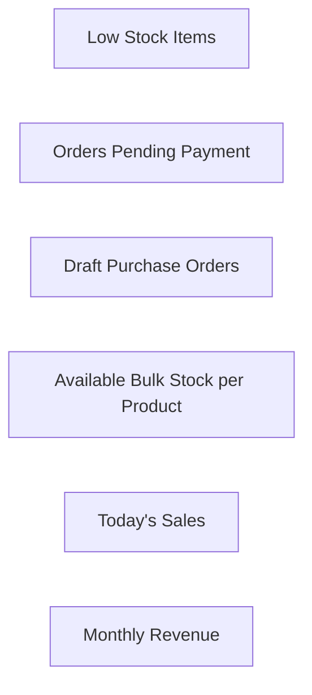

- **Low stock items**: `GET /inventory/items` → filter `currentStock < threshold`
- **Pending payment**: `GET /sales?paymentStatus=PENDING`
- **Draft POs**: `GET /purchases?status=DRAFT`
- **Today's confirmed orders**: count from sales list
- **Revenue**: sum `discountAmount`-subtracted totals from CONFIRMED/SHIPPED orders

---

### API Integration Tips

1. **JWT Auth**: The backend uses HTTP-only cookie for JWT. Set `withCredentials: true` on Axios. No manual token storage needed.

2. **Error Handling**: All errors follow this shape:
   ```json
   { "statusCode": 409, "message": "Sales order is not in DRAFT status...", "error": "Conflict" }
   ```
   Show `message` in a toast notification.

3. **Optimistic Updates**: For line add/remove on orders, use TanStack Query's `onMutate` for instant UI feedback.

4. **Real-time feel**: After any mutation that returns `void 204`, immediately invalidate the parent order query to refetch the latest state.

5. **Pricing endpoint**: Call `GET /sales/pricing/item/:itemId` when the user hovers or focuses on an item in the sales order line form to show the suggested price as a hint.

6. **Decimal handling**: Backend returns `Decimal` fields as numbers — treat all prices as `number` with 2 decimal formatting. Use `Intl.NumberFormat` for display.

---

### Item Types Reference

| Type | Used For | Can Sell |
|------|---------|---------|
| `RAW_MATERIAL` | Recipe ingredients, purchased | No |
| `PACKAGING` | Packaging BOM, purchased | No |
| `FINAL_PRODUCT` | Filled product variants | ✅ Yes |
| `SHIPPING_PACKAGING` | Boxes/bags for shipping | ✅ Yes |

---

### Measure Units Reference

`KG` · `G` · `L` · `ML` · `PCS`

---

### Key Business Rules (Frontend Validation)

- Only items of type `FINAL_PRODUCT` or `SHIPPING_PACKAGING` can be added to a sales order line
- Only `RAW_MATERIAL` or `PACKAGING` items can be added to a purchase order line
- A recipe version can only be activated if base ingredient percentages sum to exactly 100%
- A sales order can only be edited (lines, discount) when in `DRAFT` status
- Payment can only be marked as `PAID` when `paymentStatus === 'PENDING'`
- An item can only be archived if it has zero stock
- A category can only be archived if it has no active items

---

## 11. Environment

```
BACKEND_URL=http://localhost:3000
API_PREFIX=/api/v1
AUTH_COOKIE=jwt (httpOnly)
```

Swagger UI available at `http://localhost:3000/api` during development for interactive testing.
