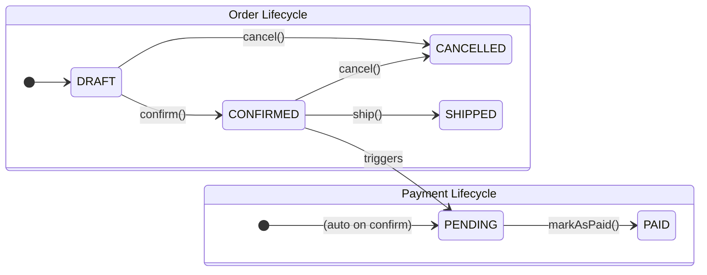
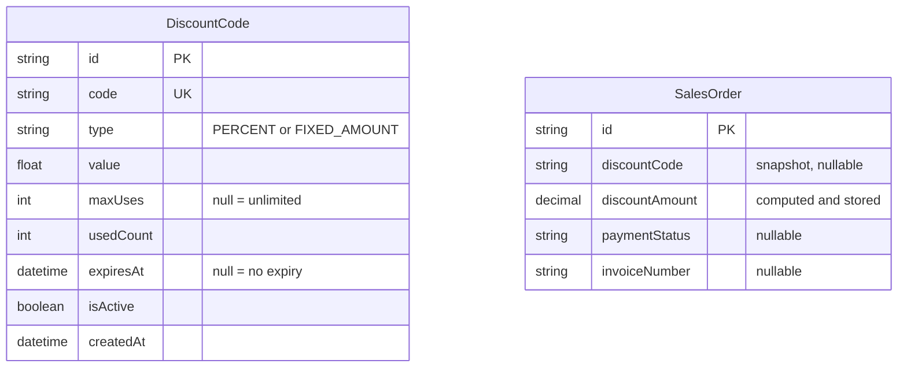
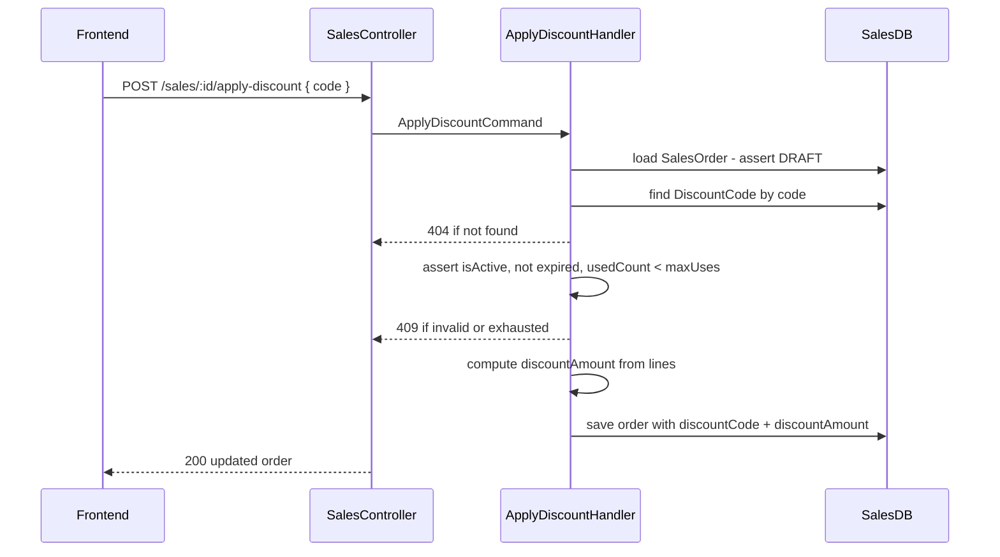
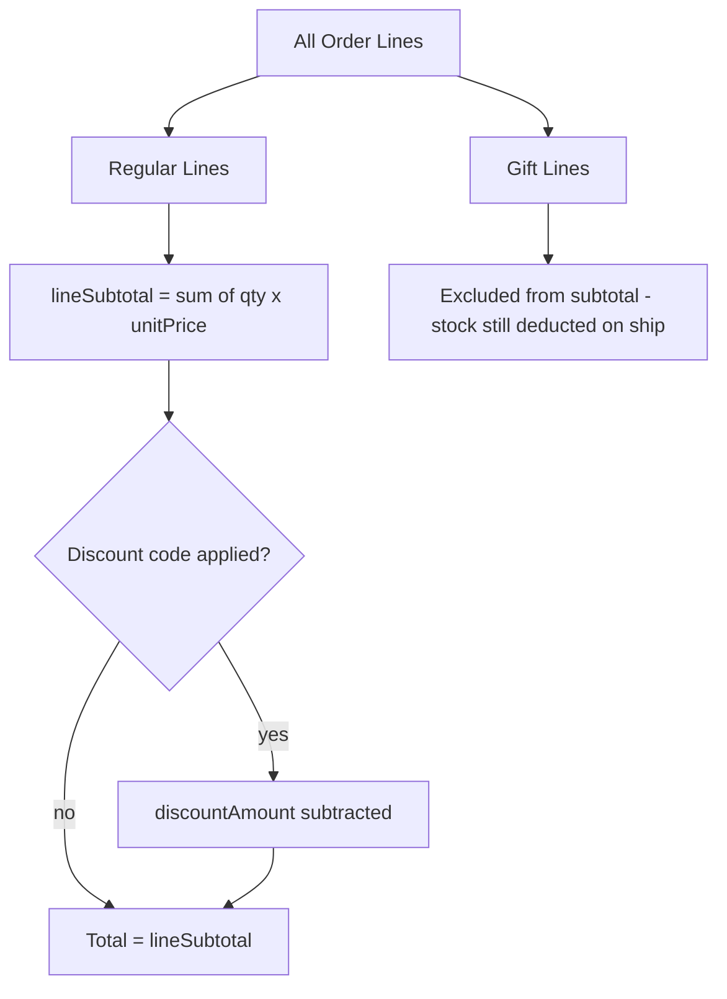
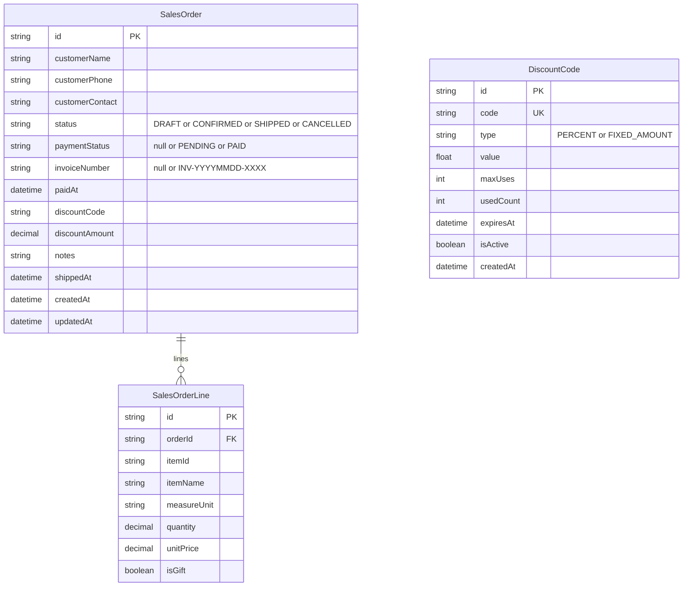

# Sales Enhancements Plan

## Overview

Three enhancements to the Sales module:
1. **Invoice & Payment Status** — `PENDING` / `PAID` lifecycle on confirmed orders
2. **Discount Codes** — promo codes applied to DRAFT orders, redeemed on CONFIRM
3. **Gift Line Support** — `isGift` flag on order lines

---

## 1. Invoice & Payment Status

### Motivation
After a sales order is CONFIRMED, the business needs to track whether the customer
has paid (upfront, on delivery, bank transfer, etc.).

### Design Decision
- **No separate Invoice entity** — payment status lives directly on `SalesOrder`
- `invoiceNumber` auto-generated on CONFIRM (format: `INV-YYYYMMDD-XXXX`)
- `paymentStatus` is orthogonal to `status` — order can be SHIPPED but still PENDING

### State Machine



### DB Changes (sales_orders table)

| Column | Type | Notes |
|--------|------|-------|
| `invoiceNumber` | `String?` | Set on CONFIRM, e.g. `INV-20260322-0001` |
| `paymentStatus` | `String?` | `null` when DRAFT/CANCELLED, `PENDING` on CONFIRM, `PAID` after markAsPaid |
| `paidAt` | `DateTime?` | Set when markAsPaid() called |

### New Endpoints

| Method | Route | Description |
|--------|-------|-------------|
| POST | `/sales/:id/mark-paid` | PENDING → PAID, sets `paidAt` |
| GET | `/sales?paymentStatus=PENDING` | Extend existing list filter |

### Domain Rules
- `markAsPaid()` only allowed when `paymentStatus = PENDING`
- `invoiceNumber` generated in handler using date + zero-padded sequence (count of confirmed orders that day + 1)
- CANCELLED orders: `paymentStatus` stays `null` forever

---

## 2. Discount Codes

### Motivation
Staff can apply a promo code to a DRAFT order. The discount reduces the order total.

### Design Decision
- **DiscountCode lives in the Sales DB** — no separate module needed
- Discount is **applied on the order as a snapshot** — even if the code is later deactivated, the order keeps its discount
- `usedCount` incremented on **CONFIRM** (not on apply) — avoids locking a code on a DRAFT that never gets confirmed
- Discount can be removed from a DRAFT before confirming

### New Entity: DiscountCode



### Apply Discount Flow



### Discount Calculation

```
PERCENT:      discountAmount = lineSubtotal × (value / 100)
FIXED_AMOUNT: discountAmount = min(value, lineSubtotal)
lineSubtotal  = Σ(line.quantity × line.unitPrice) for non-gift lines only
```

### New Endpoints

| Method | Route | Description |
|--------|-------|-------------|
| POST | `/promotions/discount-codes` | Create a discount code (admin) |
| GET | `/promotions/discount-codes` | List all codes |
| PATCH | `/promotions/discount-codes/:id` | Update or deactivate a code |
| POST | `/sales/:id/apply-discount` | Apply code to a DRAFT order |
| DELETE | `/sales/:id/discount` | Remove discount from a DRAFT order |

### DB Changes (sales_orders table)

| Column | Type | Notes |
|--------|------|-------|
| `discountCode` | `String?` | Snapshot of code applied |
| `discountAmount` | `Decimal` | `@default(0)` |

### Module Decision
Discount code CRUD lives in a thin `PromotionsModule` (own controller, table in Sales DB).
Sales module calls it via `IPromotionsFacade` to validate and snapshot a code at apply time.

---

## 3. Gift Line Support

### Motivation
Some order lines are gifts — sent to the customer at no charge. The business still needs
to track the item (for stock deduction) and see the original value for COGS purposes.

### Design Decision
- `isGift: boolean` on `SalesOrderLine`
- Gift lines **still deduct stock** on SHIP (item still leaves the warehouse)
- `unitPrice` is kept as-is for COGS tracking — the price field represents cost, not what the customer was charged
- Discount codes **exclude gift lines** from the subtotal calculation
- Frontend shows gift lines with a special tag; displays "Gift" instead of the price

### DB Changes (sales_order_lines table)

| Column | Type | Notes |
|--------|------|-------|
| `isGift` | `Boolean` | `@default(false)` |

### DTO Changes

```
AddLineRequestDto:    + isGift?: boolean  (defaults to false)
UpdateLineRequestDto: + isGift?: boolean
```

### Order Total Flow



---

## Combined SalesOrder Shape After All 3 Features



---

## Implementation Order

1. **Gift lines** — smallest change: 1 field on `SalesOrderLine` + DTO update + migration
2. **Invoice + Payment Status** — medium: extend `SalesOrder.confirm()` to generate invoice number + set `paymentStatus = PENDING`, new `markAsPaid` command + controller, DB migration
3. **Discount Codes** — largest: new `PromotionsModule` (DiscountCode CRUD), `IPromotionsFacade`, `applyDiscount` + `removeDiscount` commands on Sales, 2 new fields on `SalesOrder`, DB migration
