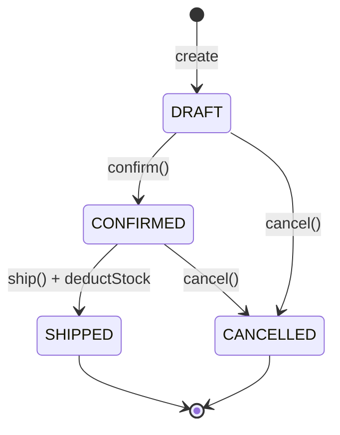
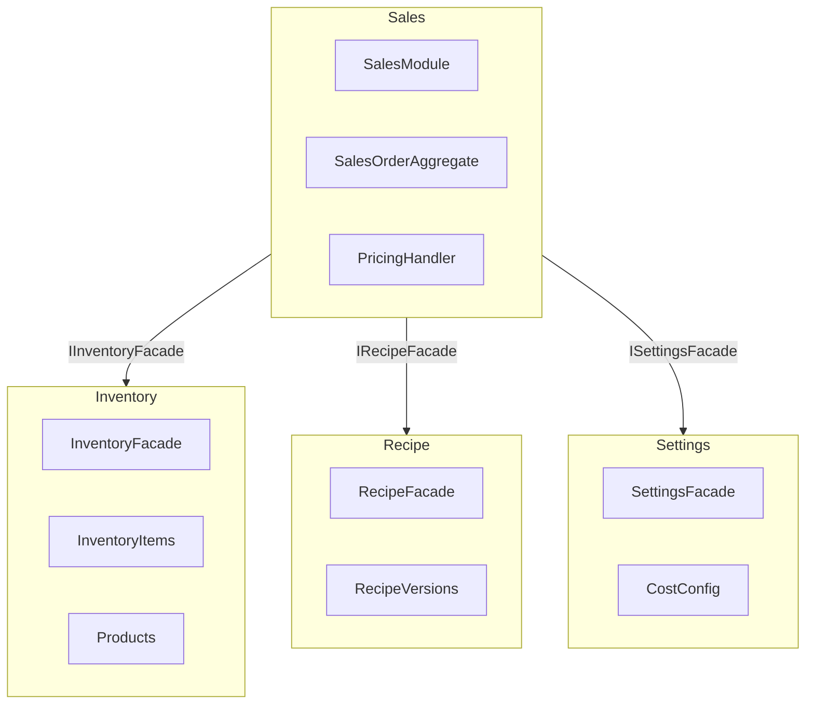

# Sales Module Plan

## Overview

The Sales module covers selling FINAL_PRODUCT and SHIPPING_PACKAGING items to customers with a full cost-breakdown/suggested-pricing endpoint. It follows the same DDD + CQRS + Clean Architecture pattern as Purchase and Production.

**Key design decisions:**
- Stock is deducted on **SHIP** (mirrors PO restocking on RECEIVED)
- **Customer snapshot** — `customerName`, `customerPhone`, `customerContact` captured at order time (no Customer entity)
- **SHIPPING_PACKAGING as explicit line items** — same flow as FINAL_PRODUCT
- **Global margin in Settings** — `defaultMarginPercent` added to `CostConfig`; order line price is always manually entered but staff can consult the pricing endpoint

---

## Lifecycle State Machine



**Rules:**
- `addLine` / `removeLine` / `updateLine` / `updateNotes` → only in DRAFT
- `cancel()` → DRAFT or CONFIRMED only; throws if SHIPPED
- `ship()` → CONFIRMED only; deducts stock for every line

---

## Cross-Module Dependency Graph



---

## Pricing Calculation Formula

```
Given:
  item          = FINAL_PRODUCT with unitWeightGm
  product       = item.product with referenceBatchGm, referenceDurationMin, referenceWastePercent
  recipe        = active RecipeVersion for product (base ingredients only, isAddOn=false)
  costConfig    = CostConfig (monthlySalary, monthlyWorkingHours, depreciationPerMinute, defaultMarginPercent)

Step 1 — Units per batch:
  unitsPerBatch = referenceBatchGm / unitWeightGm

Step 2 — Labor cost per unit:
  hourlyRate       = monthlySalary / monthlyWorkingHours
  minuteRate       = hourlyRate / 60
  laborPerBatch    = minuteRate × referenceDurationMin
  laborPerUnit     = laborPerBatch / unitsPerBatch

Step 3 — Depreciation per unit:
  depreciationPerBatch = depreciationPerMinute × referenceDurationMin
  depreciationPerUnit  = depreciationPerBatch / unitsPerBatch

Step 4 — Material cost per unit:
  For each base ingredient (isAddOn=false):
    gmsUsed = (pct/100) × referenceBatchGm × (1 + referenceWastePercent/100)
    cost    = gmsUsed × ingredient.WAUP
  materialPerUnit = Σ(cost) / unitsPerBatch

Step 5 — Packaging cost per unit:
  For each packagingComponent of the variant item:
    cost = component.qtyPerUnit × packaging.WAUP
  packagingPerUnit = Σ(cost)

Step 6 — Total COGS and suggested price:
  totalCogs      = material + labor + depreciation + packaging
  suggestedPrice = totalCogs × (1 + defaultMarginPercent/100)
```

---

## Endpoint Table

| Method | Route | Status | Description |
|--------|-------|--------|-------------|
| POST | `/api/v1/sales` | 201 | Create DRAFT sales order |
| GET | `/api/v1/sales` | 200 | List all sales orders (optional `?status=` filter) |
| GET | `/api/v1/sales/:id` | 200 | Get sales order by ID |
| PATCH | `/api/v1/sales/:id` | 200 | Update order notes |
| POST | `/api/v1/sales/:id/confirm` | 204 | DRAFT → CONFIRMED |
| POST | `/api/v1/sales/:id/ship` | 204 | CONFIRMED → SHIPPED + deduct stock |
| POST | `/api/v1/sales/:id/cancel` | 204 | DRAFT/CONFIRMED → CANCELLED |
| POST | `/api/v1/sales/:id/lines` | 201 | Add line (FINAL_PRODUCT or SHIPPING_PACKAGING only) |
| PATCH | `/api/v1/sales/:id/lines/:lineId` | 200 | Update line quantity/price |
| DELETE | `/api/v1/sales/:id/lines/:lineId` | 204 | Remove line |
| GET | `/api/v1/sales/pricing/item/:itemId` | 200 | Get full COGS breakdown + suggested price |

---

## Module Structure

```
src/modules/sales/
├── shared/
│   └── sales.module.ts
└── internal/
    ├── application/
    │   ├── commands/
    │   │   ├── create-sales-order/
    │   │   ├── add-line/
    │   │   ├── update-line/
    │   │   ├── remove-line/
    │   │   ├── update-sales-order/
    │   │   ├── confirm-sales-order/
    │   │   ├── ship-sales-order/
    │   │   └── cancel-sales-order/
    │   ├── queries/
    │   │   ├── get-sales-order/
    │   │   └── get-all-sales-orders/
    │   ├── pricing/
    │   │   └── get-item-pricing/
    │   └── errors/
    ├── domain/
    │   ├── aggregates/sales-order.aggregate.ts
    │   ├── entities/sales-order-line.entity.ts
    │   ├── value-objects/
    │   ├── errors/sales-order.errors.ts
    │   └── repositories/sales-order.repo.interface.ts
    ├── infrastructure/
    │   ├── database/prisma/schema.prisma
    │   ├── repositories/
    │   ├── query-handlers/
    │   └── gateways/
    └── presentation/
        ├── controllers/
        └── dtos/
```

---

## Dependencies on Other Modules

| Module | Facade Interface | Used For |
|--------|-----------------|----------|
| Inventory | `IInventoryFacade` | `getItem()`, `getProduct()`, `deductItem()` |
| Recipe | `IRecipeFacade` | `getActiveRecipeByProduct()` |
| Settings | `ISettingsFacade` | `getCostConfig()` (incl. `defaultMarginPercent`) |

**Note:** Settings module requires `defaultMarginPercent` added to `CostConfig` (Task 2).
`ProductFacadeDto` and `InventoryItemDto` require `productId` and reference fields added (needed for pricing).
