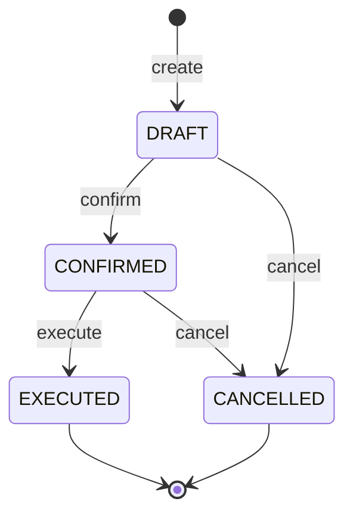
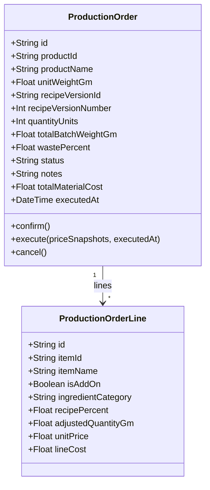
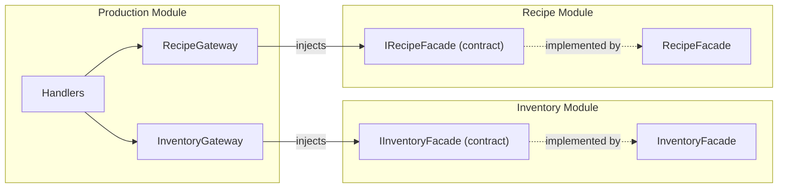
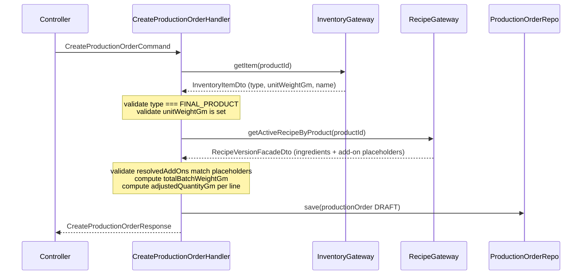
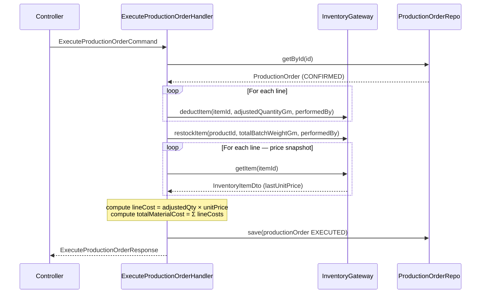

# Production Module — Design Discussion

## Overview

The `production` module manages **ProductionOrders** — the act of manufacturing a batch of a final product using an approved recipe. It is the operational bridge between the Recipe module (what to make) and the Inventory module (raw material consumption + finished goods replenishment).

---

## Core Concept

A user says: **"I want to make 5 jars of Body Butter 125g."**

The system:
1. Looks up the FINAL_PRODUCT item → gets unit weight (125g) and name
2. Finds the ACTIVE recipe version for that product → gets ingredient list + add-on placeholders
3. User resolves add-on placeholders (e.g., selects which fragrance item to use)
4. User sets waste % (e.g., 10%)
5. System computes adjusted ingredient quantities per line:
   `adjustedQty = (ingredient% / 100) × totalBatchWeight × (1 + wastePercent / 100)`
   where `totalBatchWeight = quantityUnits × unitWeightGm`
6. On execution: deducts every ingredient from inventory, restocks the final product

---

## Design Decisions

| Decision | Choice | Reason |
|---|---|---|
| Entry point | Select **product** (FINAL_PRODUCT), not recipe | Users think in products, not formulas |
| Recipe lookup | Auto-find ACTIVE recipe for the product | One click, not two |
| Batch size | `quantityUnits × unitWeightGm` | Intuitive: "I want 5 jars of 125g" |
| `unitWeightGm` home | Inventory Item (FINAL_PRODUCT only) | Property of the product, not the run |
| Cost storage | Snapshot at EXECUTE time (lineCost + totalMaterialCost) | For future Accountant module; nulls until execution |
| Cost preview | Frontend responsibility | Backend data available via existing item/recipe APIs |
| Cross-module | Facade pattern (same as Purchase → Inventory) | Established project standard |

---

## Aggregate: ProductionOrder

```
ProductionOrder
├── id
├── productId           (FINAL_PRODUCT item id — denormalized ref)
├── productName         (snapshot at creation)
├── unitWeightGm        (snapshot from item at creation)
├── recipeVersionId     (snapshot)
├── recipeVersionNumber (snapshot)
├── quantityUnits       (e.g. 5 jars)
├── totalBatchWeightGm  (quantityUnits × unitWeightGm)
├── wastePercent        (0–100, e.g. 10)
├── status              DRAFT → CONFIRMED → EXECUTED | CANCELLED
├── notes
├── totalMaterialCost   (null until EXECUTED)
├── executedAt          (null until EXECUTED)
├── createdAt / updatedAt
└── lines: ProductionOrderLine[]
    ├── id
    ├── itemId           (snapshot — null if colorant/fragrance had no itemId, but always resolved here)
    ├── itemName         (snapshot)
    ├── isAddOn          (bool)
    ├── ingredientCategory (FRAGRANCE | COLORANT | null)
    ├── recipePercent    (w/w% from recipe)
    ├── adjustedQuantityGm
    ├── unitPrice        (null until EXECUTED — snapshotted from item's lastUnitPrice)
    └── lineCost         (null until EXECUTED — adjustedQuantityGm × unitPrice)
```

### Domain Rules
- Only DRAFT orders can be updated
- Only DRAFT/CONFIRMED orders can be cancelled
- Only CONFIRMED orders can be executed
- Cannot execute with zero lines
- On execute: prices snapshot, line costs computed, totalMaterialCost = Σ(lineCosts where not null)

---

## Status Lifecycle



---

## Aggregate Structure



---

## Module Dependencies



---

## Commands

| Command | Transition | Key logic |
|---|---|---|
| `create-production-order` | → DRAFT | Fetch product (unitWeightGm, name), fetch ACTIVE recipe, validate add-ons match recipe placeholders, compute lines |
| `update-production-order` | DRAFT only | Recalculate lines; re-snapshot recipe + product data |
| `confirm-production-order` | DRAFT → CONFIRMED | Status transition only |
| `execute-production-order` | CONFIRMED → EXECUTED | Deduct each ingredient; restock final product; snapshot prices; compute costs |
| `cancel-production-order` | DRAFT/CONFIRMED → CANCELLED | Status transition only |

## Queries

| Query | Filters |
|---|---|
| `get-production-order` | by id — includes full lines |
| `get-all-production-orders` | productId, status, dateFrom, dateTo |

---

## Cross-Module Communication

### Production → Inventory (`IInventoryFacade`)

Existing facade extended with:
- `deductItem(data: DeductItemDto): Promise<void>` — NEW
- `InventoryItemDto` enriched with `unitWeightGm: number | null` and `lastUnitPrice: number | null`

### Production → Recipe (`IRecipeFacade`) — NEW

Recipe module adds a facade publishing:
```ts
getActiveRecipeByProduct(productId: string): Promise<RecipeVersionFacadeDto | null>
```

`RecipeVersionFacadeDto`:
```ts
{
  versionId: string
  productId: string
  versionNumber: number
  ingredients: {
    itemId: string | null
    itemName: string
    isAddOn: boolean
    ingredientCategory: string | null   // 'FRAGRANCE' | 'COLORANT'
    recipePercent: number
  }[]
}
```

---

## Sequence Diagrams

### Create Production Order



### Execute Production Order



---

## Key Handler Logic

### create-production-order
```
1. Fetch product via InventoryGateway.getItem(productId)
   → validate type === FINAL_PRODUCT
   → get unitWeightGm (must be set), productName
2. Fetch ACTIVE recipe via RecipeGateway.getActiveRecipeByProduct(productId)
   → error if none found
3. Validate resolvedAddOns:
   → for each isAddOn ingredient in recipe (FRAGRANCE/COLORANT), user must provide a matching itemId
   → verify those items exist and are RAW_MATERIAL
4. totalBatchWeightGm = quantityUnits × unitWeightGm
5. Build lines (base ingredients + resolved add-ons):
   adjustedQty = (percent/100) × totalBatchWeightGm × (1 + wastePercent/100)
6. Aggregate.create(...) → save
```

### execute-production-order
```
1. Load order → validate CONFIRMED
2. For each line: InventoryGateway.deductItem(itemId, adjustedQuantityGm, performedBy)
3. InventoryGateway.restockItem(productId, quantityUnits × unitWeightGm, performedBy)
4. Fetch lastUnitPrice per line via InventoryGateway.getItem(itemId)
5. order.markExecuted(priceSnapshots, executedAt)
   → computes lineCosts, totalMaterialCost
6. Save
```

---

## Inventory Module Additions (Phase A)

| Addition | Detail |
|---|---|
| `unitWeightGm` on Item | Optional float, only meaningful for FINAL_PRODUCT |
| `lastUnitPrice` on item read model | Denormalized from last restock transaction with a unitPrice |
| `deductItem` on IInventoryFacade | Mirrors restockItem — enables inventory deduction from other modules |
| `DeductItemDto` in contracts | itemId, quantity, performedBy, notes |

---

## Prisma Schema (production DB)

```prisma
datasource db {
  provider = "postgresql"
  url      = env("PRODUCTION_DATABASE_URL")
}

generator client {
  provider = "prisma-client-js"
  output   = "../generated/client"
}

model ProductionOrder {
  id                  String               @id @default(uuid())
  productId           String
  productName         String
  unitWeightGm        Float
  recipeVersionId     String
  recipeVersionNumber Int
  quantityUnits       Int
  totalBatchWeightGm  Float
  wastePercent        Float
  status              String
  notes               String?
  totalMaterialCost   Float?
  executedAt          DateTime?
  createdAt           DateTime             @default(now())
  updatedAt           DateTime             @updatedAt
  lines               ProductionOrderLine[]
}

model ProductionOrderLine {
  id                 String          @id @default(uuid())
  productionOrderId  String
  itemId             String
  itemName           String
  isAddOn            Boolean
  ingredientCategory String?
  recipePercent      Float
  adjustedQuantityGm Float
  unitPrice          Float?
  lineCost           Float?
  productionOrder    ProductionOrder @relation(fields: [productionOrderId], references: [id])
}
```

---

## Application Errors

```ts
ProductionOrderNotFoundApplicationError   extends NotFoundError
NoActiveRecipeForProductError             extends ConflictError
ProductNotFinalProductError               extends ConflictError
ProductMissingUnitWeightError             extends ConflictError
AddOnMismatchError                        extends ConflictError
InsufficientStockError                    extends ConflictError
```

---

## Future Considerations

- **Accountant module**: Will query production orders for `totalMaterialCost` grouped by period/product to compute COGS (Cost of Goods Sold)
- **Partial execution**: Not in scope — orders are all-or-nothing
- **Multi-colorant / multi-fragrance**: Recipe can have multiple add-on placeholders; each is resolved independently
- **Yield tracking**: Actual yield vs. theoretical batch size — not in scope for v1
