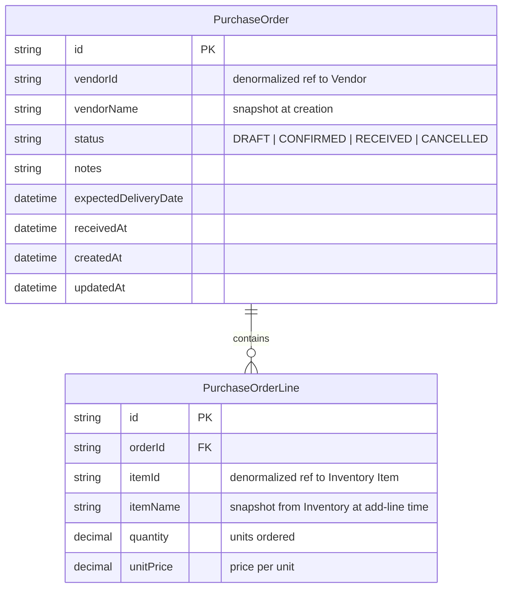
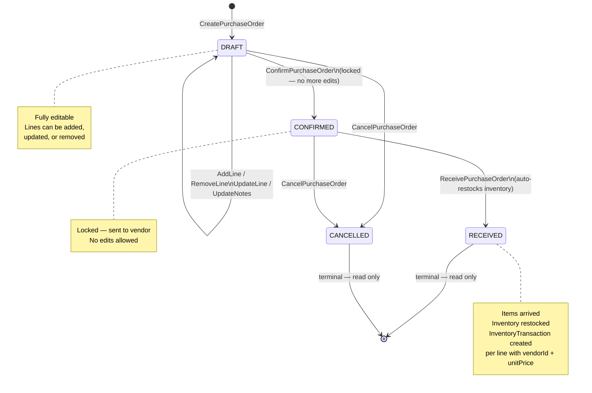
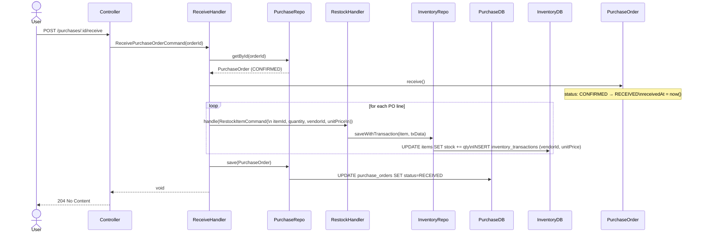
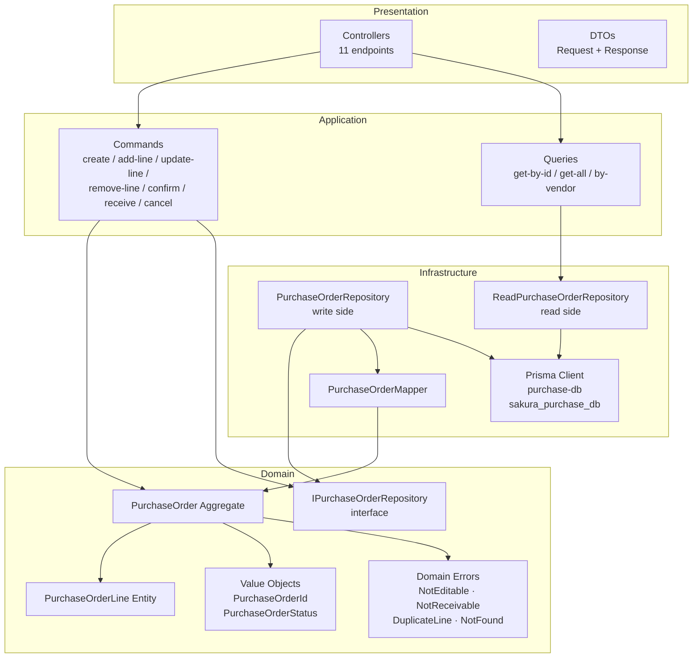
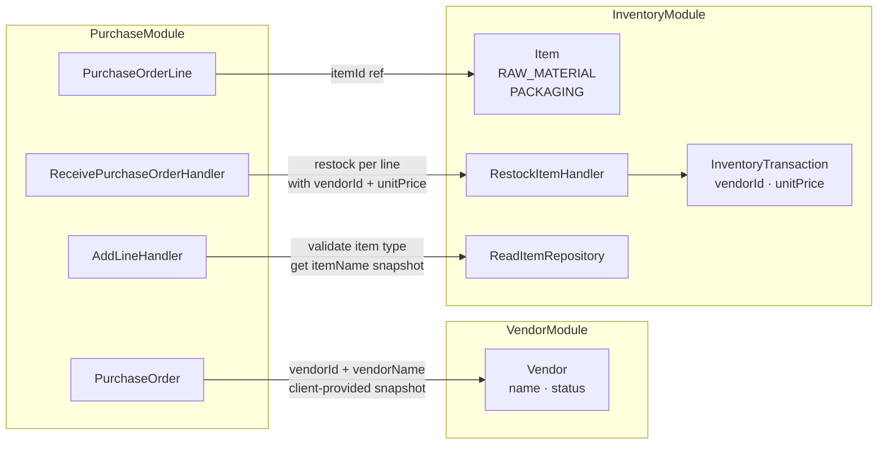

# Purchase Module — Design Discussion

Sakura ERP · Cosmetics Factory · Procurement Management

---

## 1. Purpose

The **Purchase Module** manages procurement of RAW_MATERIAL and PACKAGING inventory
items from vendors. A Purchase Order (PO) tracks what was ordered, from whom, at what
price, and when received. Upon receipt, inventory is automatically restocked — including
`vendorId` and `unitPrice` on the InventoryTransaction for full audit trail.

---

## 2. Entity Relationship Diagram

> **Cross-module references**: `vendorId` is a string reference to Vendor module (client-provided
> snapshot of `vendorName`). `itemId` is validated against Inventory at write time and `itemName`
> is snapshotted automatically.

---

## 3. Purchase Order Lifecycle

---

## 4. Receive PO — Sequence Flow

---

## 5. Module Internal Architecture

---

## 6. Cross-Module Integration

> **Design**: `vendorName` is client-provided snapshot (no Vendor validation).
> `itemName` is auto-fetched from Inventory at add-line time (validated + snapshotted).
> No cross-module calls at read time — all data is self-contained in Purchase DB.

---

## 7. API Endpoints Summary

| Method | Path | Description |
|--------|------|-------------|
| POST | `/api/v1/purchases` | Create new DRAFT PO |
| GET | `/api/v1/purchases` | List POs (filter: vendorId, status) |
| GET | `/api/v1/purchases/:id` | Get PO by ID (includes lines) |
| PATCH | `/api/v1/purchases/:id` | Update notes (DRAFT only) |
| POST | `/api/v1/purchases/:id/confirm` | DRAFT → CONFIRMED |
| POST | `/api/v1/purchases/:id/receive` | CONFIRMED → RECEIVED + restock |
| POST | `/api/v1/purchases/:id/cancel` | DRAFT\|CONFIRMED → CANCELLED |
| POST | `/api/v1/purchases/:id/lines` | Add line (DRAFT only) |
| PATCH | `/api/v1/purchases/:id/lines/:lineId` | Update line qty/price (DRAFT only) |
| DELETE | `/api/v1/purchases/:id/lines/:lineId` | Remove line (DRAFT only) |
| GET | `/api/v1/purchases/vendor/:vendorId` | Get all POs for a vendor |

---

## 8. Domain Rules Summary

| Rule | Enforcement |
|------|-------------|
| Only DRAFT POs can be edited | `PurchaseOrderNotEditableError` in aggregate |
| Only CONFIRMED POs can be received | `PurchaseOrderNotReceivableError` in aggregate |
| RECEIVED POs cannot be cancelled | `PurchaseOrderNotCancellableError` in aggregate |
| Same item cannot appear twice in one PO | `DuplicateLineItemError` + DB `@@unique([orderId, itemId])` |
| Item must be RAW_MATERIAL or PACKAGING | Validated in `AddLineHandler` via Inventory read repo |
| Auto-restock on receive | `ReceivePurchaseOrderHandler` calls `RestockItemHandler` per line |
| `unitPrice` tracked on InventoryTransaction | Passed through `RestockItemCommand` → `saveWithTransaction` |

---

## 9. Inventory Module Changes Required

Small backwards-compatible additions:

| File | Change |
|------|--------|
| `restock-item.command.ts` | Add `unitPrice?: number \| null` field |
| `restock-item.handler.ts` | Pass `unitPrice` to `saveWithTransaction` |
| `item.repository.ts` | Store `unitPrice` (field already exists in schema, was always null) |
| `inventory.module.ts` | Add `exports: [ReadItemRepository, RestockItemHandler]` |

Existing callers are unaffected — `unitPrice` defaults to null.
